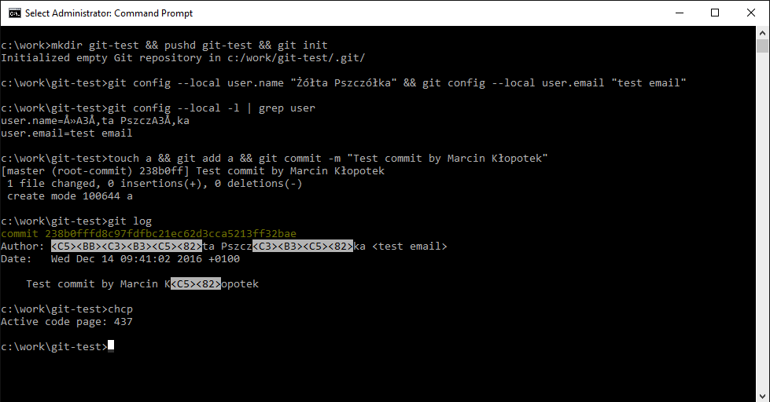

# Дизайн API в С++

В этом году на C++ Russia я рассказывал про [API дизайн](https://cppconf.ru/en/talks/97d7a921faf846189a24169a4659b61f). Эта статья – пересказ и переосмысление моего доклада.

То, что я здесь расскажу, основано на моем личном опыте – про API дизайн я думаю уже лет 15, с того момента как в 2008м начал читать ревью библиотек на входе в boost (кстати, всем рекомендую).

В первой части я сфокусируюсь на базовых вещах, которые применимы практически к любому императивному языку программирования, не только к C++. Будет также часть 2, более приближенная собственно к C++, в которой я расскажу о некоторых фичах языка и стандартной библиотеки, которые помогут вам сделать ваши API еще лучше.


# Программная Архитектура

Сначала поговорим об архитектуре. В современных инженерных кругах каждый раз когда кто-то говорит слово "Архитектура," многие сразу думают о System Design собеседованиях в крупные зарубежные компании – как из кафки, редиса и PostgreSQL собрать сервис, который будет json'ы перекладывать.

Мы сегодня будем говорить об архитектуре на более низком уровне – об архитектуре на уровне отдельной программы или сервиса. 

У вас было такое, что вы реализуете какую-то функциональность, код получается сложный и непонятный, вы сажаете баги, в итоге после долгих мучений ваш код все-таки начинает работать, и вы со вздохом облегчения коммитите свои изменения. И все это время вас не покидает ощущение, что все то, что вы делаете, можно сделать проще, но для этой легкости и простоты вам чего-то не хватает, но вы не понимаете, чего.

А потом приходит ваш друг-продакт и говорит, что требования изменились, и вы с ужасом понимаете, что проще выкинуть все, что вы написали на предыдущей итерации, чем пробовать подвести под новые требования.

Если вы оказались в такой ситуации – вам пора задуматься об архитектуре вашего ПО.

Архитектура – это вид с высоты птичьего полета. Например, если вы пишете графический редактор, то вам наверняка придется написать код сохранения и загрузки разных форматов изображений, код инструментов, которые будут доступны пользователю, реализацию undo/redo, код различных фильтров, и т.п. Архитектура – это про то, как весь этот код связать в единое целое так, чтобы получилось достаточно гибкое решение.

Чем архитектура, о которой вовремя подумали, отличается от архитектуры, которая сама как-то зародилась, как жизнь в кастрюле с макаронами которую вы забыли на балконе? Что вообще такое "хорошая архитектура?" Мне нравится [тейк](https://gameprogrammingpatterns.com/architecture-performance-and-games.html) автора Game Programming Patterns:

> What is *good* software architecture?
>
> For me, good design means that when I make a change, it’s as if the entire program was crafted in anticipation of it. I can solve a task with just a few choice function calls that slot in perfectly, leaving not the slightest ripple on the placid surface of the code.
> 
> That sounds pretty, but it’s not exactly actionable. “Just write your code so that changes don’t disturb its placid surface.” Right.
> 
> Let me break that down a bit. The first key piece is that architecture is about change. Someone has to be modifying the codebase. If no one is touching the code — whether because it’s perfect and complete or so wretched no one will sully their text editor with it — its design is irrelevant. The measure of a design is how easily it accommodates changes. With no changes, it’s a runner who never leaves the starting line.

За мыслью о легкости изменений на самом деле лежит довольно много:
* Хорошая архитектура помогает быстро разобраться в коде. Это в частности предполагает минимизацию количества абстракций и движущихся частей, о которых надо помнить при написании нового кода или модификации существующего.
* Хорошая архитектура помогает с локальностью изменений. У вас бывало такое, что чтобы реализовать какую-то новую фичу нужно воткнуть десяток-другой if'ов по всей кодовой базе? Это пример нелокальности изменений.
* Хорошая архитектура помогает не сажать баги. 
* Если вы все-таки посадили баг, то хорошая архитектура помогает быстро его найти.
* Хорошая архитектура находит баланс между гибкостью и простотой. Вы наверняка участвовали в проектах, в которых разработчики увлеклись и *наархитектурили* – такое бывает когда продуктовые требования не ясны, и инженеры стараются предусмотреть все возможные пути дальнейшего развития продукта, и в итоге за *архитектурностью* теряется суть происходящего. 
* Хорошая архитектура помогает быстрее решать возникающие бизнес-задачи. Реализовывать фичи. Ускорять тормозные участки.

И самое главное – хорошая архитектура отвечает внешним требованиям. Это в частности означает, что если вы пишете прототип, то ничего из того что я здесь написал вам не нужно – вам нужно за минимальное время собрать что-то рабочее. Возможно после этого вы этот прототип просто выкинете.

На мой взгляд, об архитектуре нужно задумываться если:
* Вы пишете код, который будет долго жить и широко использоваться.
* Вы пишете библиотечный код.
* Вы любите неконтролируемо *архитектурить* и хотите научиться делать это контролируемо.

Вопрос инвестирования усилий разработчиков в хорошую архитектуру – это на самом деле вопрос того, вернутся ли эти инвестиции. Оценить это без большого опыта в разработке бывает сложно, особенно если обе рассматриваемых альтернативы (инвестировать vs не инвестировать) покрыты для вас мраком, и конкретные шаги вам не ясны. Решить не инвестировать время в архитектуру потому что в данный момент этого не требуется, и не инвестировать в архитектуру потому что вы не понимаете, как и зачем – это две очень разные ситуации, которые при этом для стороннего наблюдателя могут выглядеть абсолютно одинаково. Вот только в первой ситуации решение приняли вы, а во второй ситуации решение *случилось само*. В этой статье я постараюсь частично развеять мрак, чтобы вы лучше понимали, какие шаги нужно предпринять, чтобы сделать ваш код лучше, и чаще оказывались в ситуации, когда вы можете принять осведомленное решение – архитектурить, или и так сойдет.


# Что такое API Design?

Понятие API дизайна на самом деле тесно переплетено с понятием программной архитектуры.

И если архитектура в целом – это вид с высоты птичьего полета, то API дизайн – это вид вблизи, это то, что происходит между отдельными компонентами системы. Как связать А и Б, как написать код так чтобы потом не ловить баги, и тп.

Про архитектуру вы думаете когда проектируете ваше ПО, и когда делаете достаточно глобальные рефакторинги. Про API вы думаете каждый день. Каждый раз когда вы пишете сигнатуру новой функции – вы занимаетесь API дизайном. Вот так – если программируешь – значит ты API-дизайнер!

Все свойства хорошей архитектуры напрямую транслируются в API дизайн.


# Зачем нужны хорошие API?

Вот две интересные ссылки:
* [The Wonderfully Terrible World of C and C++ Encoding APIs (with Some Rust)](https://thephd.dev/the-c-c++-rust-string-text-encoding-api-landscape). 
* И продолжение – [cuneicode, and the Future of Text in C](https://thephd.dev/cuneicode-and-the-future-of-text-in-c).

По этим ссылкам один участник комитета по стандартизации C и С++ очень качественно *горит*. У многих людей на словосочетание "комитет по стандартизации С++" аллергия – они сразу представляют себе сборище бородатых дедов, которые все время что-то там стандартизируют, и каждый раз получается какая-то ~~какаха~~ оторванная от жизни фигня. Так вот, автор статьи – сразу в друх лагерях, и честно решил конструктивно посмотреть на свои страдания – "если комитет делает фигню, то я сам стану членом комитета и научу их как надо!" В частности, он недавно [протащил](https://open-std.org/JTC1/SC22/WG14/www/docs/n3017.htm) `#embed` в С.

И горит он качественно потому, что на дворе 2023й год, нормальной библиотеки для работы с разными энкодингами по-прежнему нет, и мы все еще иногда наблюдаем что-то такое:



На самом деле проблема на скриншоте глубже и многограннее, чем банальное отсутствие библиотеки для работы с разными энкодингами, но в корне проблемы все равно лежат кривые API.

Как и в корне многих других проблем в [национальной базе уязвимостей](https://nvd.nist.gov/). Зачастую все начинается с примерно такого кода:
```cpp
char buf[1024];
```

И заканчивается вот таким кодом:
```cpp
// Checking string size is for retards!
strcpy(buf, totally_safe_string);
```

`strcpy` – это типичный пример сломанного API, который уже не починить, можно только выкинуть. Функции [больше 40 лет](https://stackoverflow.com/questions/25300040/is-it-possible-to-find-out-when-the-current-syntax-of-strcpy-was-added-to-the-c), ей продолжают пользоваться, и она [продолжает стрелять](https://cve.mitre.org/cgi-bin/cvekey.cgi?keyword=strcpy).

Но я уже слышу ваши возражения. API в недрах стандартной библиотеки? Кривой `strcpy`? Я json'ы перекладываю, и вообще не помню когда в последний раз писал вызов `strcpy` руками, какое отношение это все имеет лично ко мне?

Очень простое. У вас есть такие же коллеги, которые пользуются вашим кодом так же, как мы все пользуемся стандартной библиотекой. Они точно так же горят, когда пытаются переиспользовать что-то, что вы написали не задумываясь о том, как сделать ваш API удобным. Пострадав немного, они решают сделать то же самое, но у себя и лучше. "Нет, мы не велосипедим," – говорят они, когда вы узнаете об этом и начинаете задавать неудобные вопросы, – "просто существующее решение нам не подходит." Они конечно же тоже не думают об API дизайне, и спустя несколько лет в вашей компании уже 5 копий одной и той же функциональности, которые растеклись в разные стороны по пространству решений вашей задачи. Тимлиды справедливо замечают, что чтобы это поддерживать, нужно больше программистов – и у вас появляются новые коллеги, которые тоже не думают про API дизайн. "Эх, вот если бы можно было все выкинуть и переписать заново," – вздыхаете вы за пивом в баре с коллегами спустя еще несколько лет.

Так вот, у меня хорошие новости – не нужно все переписывать.


# Правило API дизайна #1
## Проектируйте API так, чтобы его нельзя было использовать неправильно

Идея этого правила очень простая – ваш код должен или работать корректно, или завершаться с ошибкой (или `assert`'ом), и не должно существовать последовательности вызовов, которые приводят ваш класс (или модуль) в некорректное состояние.

Более того, чем меньше у вашего API способов завершиться с ошибкой – тем лучше! Зачем думать об ошибках и обрабатывать их, если можно спроектировать API, в котором их просто не будет?

Давайте посмотрим на несколько примеров.


### Пример #1: Логирование

Например, предположим что вы пишете обертку над библиотекой для логирования:
```cpp
class Logger {
public:
    /**
     * @param category      Log category name. Category must have a log level assigned (`setCategoryLogLevel` 
     *                      must be called first).
     * @param level         Message log level.
     * @param fmt, args     Log message.
     */
    template<class... Args>
    void log(std::string_view category, LogLevel level, fmt::format_string<Args...> fmt, Args &&... args);

    /**
     * @param category      Log category name.
     * @param level         New log level for this category. Log messages with lower log level will be ignored.
     */
    void setCategoryLogLevel(std::string_view category, LogLevel level);
};
```

Вы хотите ловить опечатки в названиях категорий, и поэтому в методе `log` вы проверяете, что категория уже зарегистрирована – вы знаете, что у ваших коллег толстые пальцы, и опечатываться они точно будут. Но можно то же самое сделать лучше:
```cpp
class LogCategory {
public:
    LogCategory(std::string_view name, LogLevel level);

    void setLogLevel(LogLevel level);

    // ...
};

class Logger {
public:
    template<class... Args>
    void log(const LogCategory &category, LogLevel level, fmt::format_string<Args...> fmt, Args &&... args);

    // Don't be a retard and don't do `log(LogCategory("blabla", LOG_INFO), ...)`, create a variable for your 
    // `LogCategory` and reuse it.
    template<class... Args>
    void log(LogCategory &&, Args &&...) = delete;
};
```

При таком API у вас сразу пропадает проблема того, что пользователь может опечататься в названии категории – опечатываться-то теперь негде! Только в названии переменной типа `LogCategory`, а это поймает компилятор.


### Пример #2: Менеджер CSV файлов

Рассмотрим еще один пример. Предположим, что вы пишете какую-то автоматизацию для машинного обучения, и вам не повезло и все данные хранятся на диске в CSV файлах. Логика приложения такая, что по CSV файлам считаются статистики, которые потом используются в коде, и код может решить обновить CSV файл. Вы решаете написать обертку:

```cpp
struct CsvStats {
    DateTime startTime; // First timestamp in CSV table.
    DateTime endTime;   // Last timestamp in CSV table.
    // ...
};

class CsvDb {
public:
    explicit CsvDb(std::string_view path);

    std::string path(std::string_view tableName);

    CsvStats stats(std::string_view tableName);
    void setStats(std::string_view tableName, CsvStats stats);
};
```

> 📝 Вы наверняка хотите спросить, зачем все это. Можно сложить данные в базу данных. Можно жить как человек и пользоваться распространенными в индустрии решениями – поднять Hadoop и Spark, например. Предположим, что в данном примере вам нужно максимально легковесное решение.

У `CsvDb` очень простой интерфейс – есть возможность получить полный путь до таблицы по имени, и есть getter и setter для статистик. Статистики сохраняются на диске в каком-нибудь `db.ini` и flush'атся после каждого вызова `setStats`. Ожидается, что пользоваться вашей оберткой будут примерно следующим образом:
1. Получат статистику по имени таблицы.
2. Если в таблице не хватает данных – докачают их.
3. Получат путь до файла с таблицей вызвав `path`, подмержат туда скачанные данные.
4. Вызовут `setStats`, чтобы обновить статистики на новые.
5. Используют обновленную таблицу.

Что здесь может пойти не так? Например то, что подсчет статистик – целиком на пользователе, и что подмерживание таблицы и обновление статистик – это не атомарная операция.

Как можно сделать то же самое лучше:

```cpp
struct CsvStats {
    DateTime startTime;
    DateTime endTime;
    // ...
};

class CsvDb {
public:
    explicit CsvDb(std::filesystem::path path);

    CsvTableReader open(std::string_view tableName);
    CsvTableWriter replace(std::string_view tableName);

    CsvStats stats(std::string_view tableName);
};

// Skipping CsvTableReader & CsvTableWriter for brevity.
```

Что изменилось:
* Теперь пользователь нашего интерфейса вообще ничего не знает о файлах.
* Статистики рассчитываются и сохраняются внутри `CsvTableWriter`. Пользователю не нужно делать это самому.
* Интерфейс стал лучше отражать суть происходящего – `open` и `replace` это по сути getter и setter для отдельной таблицы, и setter теперь можно реализовать так, чтобы таблица и ее статистика обновлялись атомарно. Предыдущая версия API концентрировалась на getter'ах и setter'ах для статистик

Правда, теперь у нас 4 класса вместо двух. Это должно навести вас на мысль!


# Правило API дизайна #2
## Divide & Conquer

Вы наверняка знакомы с акронимом SOLID. Я, честно признаться, никогда не мог запомнить, что означают все эти буквы, но две из них я помню очень четко. Даже если вы разбудите меня посреди ночи, то я уверенно вам скажу, что S – это про single responsibility, а L – это про Liskov substitution.

За S в SOLID на самом деле сидит довольно глубокая мысль. В оригинале правило звучит как "there should never be more than one reason for a class to change" и на деле это означает, что зоны ответственности классов должны быть очень небольшими. А значит и сами классы тоже должны быть небольшими.

Почему небольшие классы – это хорошо? Давайте подумаем о том, как вы на самом деле пишете код:
1. Сначала вам нужно осознать задачу – какую функциональность вы вообще хотите реализовать.
2. Затем вам нужно осознать контекст – буквально, загрузить в голову весь код, который вам нужно будет менять, и от которого так или иначе будет зависеть новая функциональность.
3. После этого вам нужно придумать решение – *как* вы поменяете код, который уже у вас в голове. 
4. Постучать пальцами по клавиатуре.

Зачастую, вся сложность оказывается вовсе не в шаге 4. Если вы работаете с большими классами, то они не влезают в вашу оперативную память. И вы или страдаете и тратите больше времени, чем могли бы, или сажаете баги.

Более того, внутри класса нет границ, все поля доступны из любого метода, и количество возможных взаимодействий между частями класса растет **как квадрат** от размера класса. А вместе с количеством взаимодействий растет и количество багов.

Дробя классы на кусочки, вы расставляете границы там, где они логически должны быть, уменьшаете количество возможных взаимодействий, а существующие взаимодействия упорядочиваете, и таким образом делаете свою жизнь проще – небольшие классы легче читать и осознавать.

Аналогично работает и с библиотеками. Классы в "помойке классов" начинают зависеть друг от друга, снова квадрат зависимостей и баги. Дробите ваш код на мелкие библиотеки! И такая же логика применима к функциям – не просто так все ругают функции на 10 экранов.


### Пример #3: Парсинг строковых данных

Это реальный код, который я взял из одного из своих проектов. Предположим, что у вас null-терминированные строки лежат в бинарном виде в файле, и вам нужно поднять их в память. И у вас уже есть вот такой код:

```cpp
/**
 * @param buffer            Input buffer to parse, contains null-terminated strings.
 * @param[out] result       Parsed strings.
 */
void parseStrings(const Buffer &buffer, std::vector<std::string> *result) {
    size_t pos = 0;                                                        
    while (pos < buffer.size()) {
        // Extract the next string.
        const char *nextPos = static_cast<const char *>(memchr(buffer.data() + pos, '\0', buffer.size() - pos));
        size_t size = (nextPos ? nextPos - buffer.data() : buffer.size()) - pos;
        std::string str = std::string(buffer.data() + pos, size);

        // Remove quotes if the string is quoted.
        if (str.size() >= 2 && str.front() == '"' && str.back() == '"')
            str = str.substr(1, str.size() - 2);

        // Store result & advance.
        result->push_back(std::move(str));
        pos += size + 1;
    }
}
```

Вы подобный код наверняка видели много раз. Что с ним не так? Например то, что неподготовленному человеку вообще не ясно, что происходит в первых трех строках. Просто попробуйте вчитаться – вот например, вы вообще помните, что возвращает `memchr`?

Тот же код можно написать гораздо более понятно, выделив несколько абстракций:

```cpp
void parseStrings(const Buffer &buffer, std::vector<std::string> *result) {
    MemoryInput input(buffer);

    std::string line;
    while (input.readLine(&line, '\0'))
        result->push_back(unquote(line));
}
```

Новая функция делает то же самое, что и старая, но в отличие от старой код теперь написан так, что всем сразу ясно, что в этой функции происходит. Мы добились этого за счет введения двух новых сущностей:
1. Класса `MemoryInput`, который отвечает за потоковое чтение из участка памяти.
2. Функции `unquote`, которая удаляет кавычки.

И класс, и новую функцию теперь можно покрыть тестами и переиспользовать в других местах.

На проделанный рефакторинг можно смотреть как на разделение нашего решения на *слои абстракции*. Для удобного потокового чтения из памяти нам не хватало соответствующей абстракции – мы выделили ее в отдельный класс с четко обозначенным интерфейсом, и теперь взаимодействуем с памятью только через этот интерфейс. И этот интерфейс делит наш код на *слои* – код ниже по стеку работает с сырой памятью, а код выше – с более высокоуровневым интерфейсом.

В целом, это очень хороший подход к дизайну API. Если вы видите сложный код:
1. Подумайте, каких абстракций вам не хватает.
2. Выделите их в отдельные сущности, и разделите свой код на слои с их использованием.

> 📝 Если пойти чуть дальше, то становится ясно, что этого кода вообще быть не должно. Если у вас null-терминированные строки лежат в файле, то просто замапьте его в память и сделайте массив из `std::string_view`, которые в эту память смотрят. А еще лучше – если у вас не сотни тысяч строк, то сложите их просто в какой-нибудь human-readable формат, для которого умные люди уже написали парсинг. Json, toml, ini, yaml, csv, prototext, и т.п.


### Пример #4: QFuture

Давайте теперь посмотрим на жизненный пример из библиотеки Qt – класс `QFuture`. Это по сути прокачанный аналог `std::future`, абстракция над асинхронным вычислением. Интерфейс выглядит примерно так:

```cpp {all}
template<class T>
class QFuture {
public:
    QFuture(const QFuture &other);

    const_iterator begin() const;
    const_iterator end() const;
    QList<T> results() const;

    void cancel();
    T takeResult();
    T result() const;

    template<class Function>
    auto then(Function &&function);
    template<class Function>
    auto then(QThreadPool *pool, Function &&function);
    template<class Function>
    auto then(QObject *context, Function &&function);

    bool isCanceled() const;
    bool isFinished() const;
    bool isRunning() const;
    bool isStarted() const;
    bool isValid() const;

    // ...
};
```

Какие у этого интерфейса есть проблемы:
* `QFuture` это ref-counted класс, то есть по сути `QFuture` это аналог `std::shared_future`.
* С другой стороны у `QFuture` есть метод `takeResult`, который явно не вписывается в концепцию `std::shared_future`.
* А `begin` / `end` – это вообще история про канал / асинхронную последовательность.
* Метод `then` с одним аргументом фундаментально сломан – у вас нет способа гарантировать, что переданная в `then` функция не будет вызвана напрямую в том же потоке, в котором вы вызвали `then`.
* Метод `then` принимающий `QObject *` в качестве контекста работает не так, как опытный пользователь Qt может ожидать – в отличие от `QObject::connect`, `QFuture::then` не следит за временем жизни переданного объекта, и у вас все упадет если переданный объект будет уничтожен до вызова континуации.
* Огромная куча методов `isXYZ` дают доступ к текущему состоянию объекта, но даже из документации не ясно, какие состояния являются взаимоисключающими, а какие – нет. Если состояния являются взаимоисключающими, то лучше предоставлять единый метод `state()`.

В общем, `QFuture` пытается быть всем и сразу. У этого желания есть большой минус, и вы увидите его если попробуете почитать исходники – в `QFutureInterfaceBasePrivate` целых 20 полей, и уследить за происходящим там очень сложно.

При этом, если вы, прочитав исходники, попробуете придумать имя для этого класса, которое хорошо бы отражало его функциональность, то у вас не получится. И это должно заставить вас задуматься.

<!-- Про QFuture::then(QObject*) - там внутри assert(QPointer<QObject>), потому что вызов происходит через
     QMetaObject::invoke. Так что оно упадет даже если не пользоваться самим объектом.

     Про QFuture::then - да, я перепроверил, что then реально может выполниться в месте вызова.
     boost::future умнее - он сохраняет контекст, так что даже есть вычисление завершилось, 
     континуация все равно будет запущена в пуле. Но это не работает если launch_policy проставлен в deferred - 
     в этом случае then вызывается inplace, и вызывающая сторона вообще говоря не знает какой policy был проставлен. 
     Так что boost::future::then тоже сломан, просто по-другому. -->


# Правило API дизайна #3
## Тратьте время на придумывание хороших имен!

Как известно, в Computer Science есть только две сложные проблемы – инвалидация кешей и придумывание имен. В этой шутке есть большая доля правды – если у вас что-то не получается нормально назвать, то это зачастую означает, что вы хотите странного, и вам нужно переделывать свой дизайн.

Перед именованием потратьте время и сформулируйте, в чем вообще концептуальная суть абстракции, которую вам нужно назвать. Не поддавайтесь на соблазны – никто не будет рад очередному классу, заканчивающемуся на `Helper`. Если все равно не получается – воспользуйтесь [thesaurus.com](https://www.thesaurus.com/) или [ChatGPT](http://chat.openai.com/). Если и после этого получается фигня – значит вы придумали кривую абстракцию, думайте еще.


### Продолжаем пример #4: QFuture

В случае `QFuture` из примера выше, если вы зададите себе правильные вопросы, то будет понятно, что за `QFuture` спрятались сразу несколько абстракций, которые стоит разделить:

```cpp
template<class T>
class QAsyncSequence {
public:
    void cancel();
    const_iterator begin() const;
    const_iterator end() const;
    QList<T> results() const;
    // ...
};

template<class T>
class QUniqueFuture {
public:
    QUniqueFuture(QUniqueFuture &&other); 
    void cancel();
    T takeResult();
    // ...
};

template<class T>
class QSharedFuture {
public:
    QSharedFuture(const QSharedFuture &other); 
    QSharedFuture(QUniqueFuture<t> &&other);
    void cancel();
    T result() const;
    // ...
};
```

`QAsyncSequence` – это абстракция над асинхронной последовательностью, а `QSharedFuture` и `QUniqueFuture` – аналоги `std::shared_future` и `std::future`. У изначального `QFuture` существовали некорректные сценарии использования, которые приводили к ошибки во время выполнения – например, можно было скопировать `QFuture`, для двух копий вызвать `takeResult`, и упасть с `assert`'ом. С новыми интерфейсами такой код просто не получится написать!

Важно обратить внимание на то, как мы пришли к новым интерфейсам – мы думали не о *классах*, а об *абстракциях*. Это очень важная мысль – на самом деле, API дизайн – это прежде всего работа с абстракциями. Перевод абстракций в конкретные интерфейсы – это последний шаг этой работы.

Но вернемся к `QFuture`. Выше я обратил ваше внимание на то, что метод `QFuture::then` с одним аргументом фундаментально сломан – у вас нет способа гарантированно исполнить континуацию в контексте выполнения операции, доступ к результату которой предоставляет `QFuture`. Если асинхронная операция завершится до вызова `then`, то континуация будет вызвана прямо изнутри `then`, и это никак нельзя обойти.

> 📝 На практике это конечно довольно редкий сценарий – обычно операции внутри `QFuture` толстые, и вы успеваете навесить континуацию через `then` до их завершения. Но сам факт того, что такой простой сценарий по сути сломан, должен навести вас на некоторые мысли.
> 
> Внимательный читатель может также заметить, что можно просто использовать `boost::future`, у которого таких проблем *почти* нет. Но дело в том, что *почти* нас не устраивает – метод `then` c одним аргументом все еще сломан, и переданная континуация все еще может быть исполнена в месте вызова, просто в отличие от `QFuture` это полностью детерминировано и определяется тем, с каким `boost::launch` был создан этот `boost::future`.

<!-- В boost::future есть приватный метод launch_policy, и then создает новый future с таким же launch policy. 
     Так что даже если изначальное вычисление уже завершилось, если launch_policy() = async, то континуация будет запущена в отдельном потоке. Проблема возникает когда launch_policy() = deferred, в этом случае код вызывается напрямую из then(). И в месте вызова мы вообще говоря не контролируем какой там launch_policy будет проставлен! Можно конечно подглядывать в launch_policy(), но на деле
     это означает что просто не нужно использовать then с одним аргументом. -->

Эти проблемы должны, в очередной раз, заставить вас задуматься. На мой взгляд, `QFuture` и `std::future` – это просто плохие абстракции. Они объединяют в одном интерфейсе асинхронную операцию и контекст, в рамках которого эта операция выполняется, и это приводит к проблемам. Можно ли сделать лучше?


### Пример #5: Лучше чем QFuture

Хорошая практика в дизайне API – начинать с клиентского кода. Если вы не знаете, какой API будет более удобен – сначала реализуйте несколько примеров использования, не имея готовой реализации самого API. Это поможет вам понять, какой вариант лучше подходит под ваши требования, а написанный код потом можно будет использовать для тестирования.

Предположим, что нам нужно реализовать асинхронную операцию, которая ходит по сети и парсит результат – например, парсит твиттер. Пользовательский код мог бы выглядеть следующим образом:
```cpp
/**
 * @param network           Network access object.
 * @param opts              Fetch options - twitter login, number of posts, etc.
 * @return                  Async fetch task. 
 */
Task<TwitterPosts> fetchTwitterPosts(Network &network, const TwitterFetchOptions &opts) {
    Task<std::string> requestTask = network.request(makeRequestUrl(opts));

    return requestTask.then([](std::string_view jsonData) {
        TwitterPosts result;
        deserialize(Json::parse(jsonData), &result);
        return result;
    });
}

void myAwesomeFunction(Network &network) {
    // Download the latest 20 posts by Bjarne Stroustrup & print them.
    TwitterPosts posts = fetchTwitterPosts(network, TwitterFetchOptions("@stroustrup", 20))
        .run(globalThreadPool())
        .join();
    fmt::println("{}", posts);
}
```

Здесь `Network::request` возвращает объект типа `Task` – абстракцию над асинхронной операцией, не привязанной к контексту выполнения. Поддержка континуаций реализована через метод `Task::then`, который тоже возвращает `Task`. Функция `fetchTwitterPosts` ничего не знает про контекст выполнения – она содержит только логику операции, контекст же передается в метод `Task::run` внутри `myAwesomeFunction` – в данном случае запрос выполняется в глобальном тредпуле.

Ключевой момент предложенного API – *ортогональность* абстракций, с которыми мы работаем. Асинхронные операции отдельно, контексты выполнения отдельно. Если очень захотеть, можно даже реализовать контекст, который будет выполнять операции в отдельных *процессах*, и все это не меняя код самих операций.

Ортогональность – это одно из ключевых свойств, которыми обладают абстракции в хорошо задизайненных библиотеках.

> 📝 Если вы пользовались `boost::asio` или `Qt`, то код выше может вызвать у вас вопросы – например, где здесь event loop. И уточнить, что асинхронные операции бывают разные – можно ждать пока байты по сети приедут, а можно считать md5 от файла на 10 гигабайт, и для первого примера вообще отдельный поток не нужен. На эти вопросы нет коротких ответов, если хотите глубже погрузиться в проблематику – рекомендую посмотреть [доклад Eric Niebler про executors](https://www.youtube.com/watch?v=xLboNIf7BTg).


# Правило API дизайна #4
## Создавайте ортогональные и взаимозаменяемые абстракции

На самом деле большая часть С++ разработчиков почти каждый день пользуются библиотекой, которая является отличной иллюстрацией практического применения этого правила. Речь, конечно, об STL.

STL определяет две ключевых абстракции – итераторы и алгоритмы. И, что самое главное – в STL эти абстракции ортогональны, и это дает возможность, к примеру, использовать единую реализацию `std::find_if` для `std::deque` и для `std::vector`.

В STL данные ортогональны логике, которая с этими данными работает, и этот подход можно распространить на очень многие предметные области. Каждый раз, когда вы пишете код, который вы кажется уже писали, подумайте – может быть вам не хватает правильных ортогональных абстракций, чтобы просто его переиспользовать. Для переиспользования выбирайте подходящий под задачу тип полиморфизма:
* Виртуальные функции и абстрактные базовые классы для динамического полиморфизма.
* Overload sets, шаблоны и концепты для статического полиморфизма.


### Немного про полиморфизм

Статический полиморфизм в C++ у большинства разработчиков ассоциируется с шаблонами, так что вы могли споткнуться на "overload sets" выше. Чтобы понять, о чем это вообще, нужно вспомнить что полиморфизм в С++ бывает двух видов:
* Интрузивный – требующий прямой поддержки в коде класса.
* Неинтрузивный – подразумевающий, что вы можете "подогнать" любой класс под требования, не меняя код класса.

Виртуальные функции и абстрактные базовые классы реализуют интрузивный динамический полиморфизм.

Overload sets реализуют неинтрузивный статический полиморфизм, и опираются на то, что статический интерфейс класса – это не только методы класса, но и свободные функции доступные через [argument dependent lookup](https://en.cppreference.com/w/cpp/language/adl). Классическими примерами являются `operator<<` для вывода в поток, и функция [`PrintTo` из Google Test](http://google.github.io/googletest/advanced.html).

Интрузивный статический полиморфизм – это просто требования на методы класса. Такой полиморфизм обычно менее гибок.

Последнее комбо – это неинтрузивный динамический полиморфизм. Классический пример – [`QVariant` из Qt](https://doc.qt.io/qt-6/qvariant.html), и идущий комплектом [`QMetaType`](https://doc.qt.io/qt-6/qmetatype.html). На самом примитивном уровне, неинтрузивный динамический полиморфизм – это `std::unordered_map<std::type_index, void(*)(void *)>`, маппинг из типа в какую-либо операцию над объектом этого типа.

В C++ важно владеть всеми типами полиморфизма, чтобы иметь возможность выбрать подходящий для вашей задачи инструмент.


### Пример #6: Пишем Roguelike

Все эти рассуждения про "вдохновляйтесь STL" и "используйте правильный тип полиморфизма" могут звучать слишком абстрактно, давайте посмотрим на конкретный пример.

Предположим, что вы много играли в [ADoM](http://adom.de/), и решили написать свою roguelike ролевую игру. Классические roguelike RPG отличались отсутствием графики, огромным количеством контента (сотни типов монстров и снаряжения), и невероятной гибкостью – [the DevTeam thinks of everything](https://nethackwiki.com/wiki/The_DevTeam_Thinks_of_Everything). Такое многообразие имеет свою цену – если вы не подумаете заранее о том, как спроектировать игровую модель, то в какой-то момент логика вашей игры будет намазана ровным слоем по всей вашей кодовой базе. Нужно реализовать про́клятый рунический меч, который иногда сам бьет ваших союзников и высасывает их души – легко, вот 10 мест в которые надо дописать немного кода. Знакомая ситуация?

Но перейдем к коду. Предположим, вы начали с базового класса для любого предмета в игре:
```cpp
class Equipment {
public:
    virtual void onUse() = 0;

    // ...
};
```

Любой предмет можно использовать, так что у базового класса есть метод `onUse`. У этого метода наверное должны быть какие-то параметры, но мы их пока что опустим и подумаем о других типах предметов:
```cpp
class Weapon : public Equipment {
public:
    virtual void onAttack(Monster &monster) = 0;
    // ...
};

class VampiricSword : public Weapon {
public:
    virtual void onAttack(Monster &monster) override {
        Damage damage(this, DMG_PHYSICAL, _dice.roll());
        monster.takeDamage(damage);

        if (damage.amount <= 1) 
            return;

        Damage healing(this, DMG_DARKMAGIC, damage.amount / 2);
        owner().heal(healing);
    }

    // ...

private:
    Dice _dice;
};
```

"Черт возьми, это выглядит *замесно*!" – думаете вы, и начинаете добавлять разные типы брони:
```cpp
class Armor : public Equipment {
public:
    virtual void onTakeDamage(Damage &damage) = 0;

    // ...
};
```

Теперь нужно реализовать щит, но вот незадача – щитом-то тоже можно бить супостатов!
```cpp
class Shield : public Armor, public Weapon { // Eeeeeh?
    // ...
};
```

И у вас проблема. Вы конечно же сразу вспоминаете, что в C++ есть виртуальное наследование, и оно даже в стандартной библиотеке используется! Сделать `class Equipment` виртуальным базовым классом – и проблема решена?

На эту тему у меня есть простое правило – **никогда** не используйте ромбовидное наследование и виртуальные базовые классы. Если вам нужно ромбовидное наследование – значит с вашим дизайном что-то не так. Обычно вы можете заменить наследование на разные формы композиции, и получить более гибкий и более интуитивно понятный дизайн.

> 📝 Да, это означает что стандартные потоки ввода-вывода задизайнены плохо – это правда, их принесли в C++ когда C++ был совсем другим языком (и назывался Cfront). Первая редакция [The C++ Programming Language](https://www.stroustrup.com/1st.html) была опубликована в 1985м, так что вы можете прикинуть, сколько лет `<iostream>`. Сегодня мы гораздо лучше понимаем, что такое хороший дизайн, да и современный C++ очень сильно отличается от C++ из 80х. В стандартной библиотеке C++ хватает спорных решений (привет `vector<bool>`, здравствуй `std::locale`), и не всегда с нее нужно брать пример.

В случае игровой модели для roguelike RPG вы можете вдохновиться [Entity Component System](https://en.wikipedia.org/wiki/Entity_component_system), и прийти к чему-то такому:
```cpp
class Event {
public:
    explicit Event(EventType type) : type(type) {}
    virtual Event() = default;

    const EventType type;

    // ...
};

class Behaviour { // Behaviours are composable pieces of event-handling logic.
public:
    Behaviour(Entity *owner): _owner(owner) {}
    virtual Behaviour() = default;

    virtual void process(Event *event) = 0;

    // ...

protected:
    Entity *owner() const {
        return _owner;
    }

private:
    Entity *const _owner = nullptr;
};

struct Entity {
    std::vector<std::unique_ptr<Behaviour>> behaviours;

    // ...
};
```

В таком подходе у вас есть события, которыми обмениваются объекты, и behaviours, которые могут эти события обрабатывать. Отдельные предметы – это экземпляры класса `Entity`, и важно, что для реализации различных предметов вам не нужно наследоваться от `Entity`, вся логика содержится в `Entity::behaviours`.

> 📝 Приведенная реализация на самом деле довольно далека от современных ECS и не отвечает на вопрос "как оптимально хранить связанные с предметами данные." Мы будет хранить данные внутри наследников `Behaviour`, это упростит все примеры, но на практике современные ECS фреймворки хранят данные отдельно.

Теперь давайте определим базовые события, которые нам будут нужны для реализации `VampiricSword`:
```cpp
/**
 * When performing an attack, this event is sent to the attacker's items to populate the damage rolls.
 */
class AttackOutEvent : public Event {
public:
    AttackOutEvent() : Event(EVENT_ATTACK_OUT) {}

    std::vector<Damage> damageRolls;

    // ...
};

/**
 * When performing an attack, this event is sent to the target's items to apply armor & protection.
 */
class AttackInEvent : public Event {
public:
    AttackInEvent() : Event(EVENT_ATTACK_IN) {}

    std::vector<Damage> damageRolls;

    // ...
};

/**
 * After a successful attack, this event is sent back to the attacker's items to notify of success / failure.
 */
class AttackNotifyEvent : public Event {
public:
    AttackNotifyEvent() : Event(EVENT_ATTACK_NOTIFY) {}

    std::vector<Damage> damageRolls;

    // ...    
};
```

Таким образом, атака будет обрабатываться следующим образом:
* Предметы игрока обработают `AttackOutEvent` и заполнят массив `damageRolls`.
* Предметы монстра обработают `AttackInEvent` и обновят массив `damageRolls`.
* Урон будет нанесен монстру.
* Предметы игрока получат нотификацию `AttackNotifyEvent` об успешной / неуспешной атаке.

Теперь реализуем `VampiricSword`:
```cpp
class WeaponBehaviour : public Behaviour {
public:
    virtual void process(Event *event) override {
        if (event->type != EVENT_ATTACK_OUT)
            return;
        AttackOutEvent *e = static_cast<AttackOutEvent *>(event);

        e->damageRolls.push_back(Damage(owner(), DMG_PHYSICAL, _dice.roll()));
    }

    // ...

private:
    Dice _dice;
};

class LifeStealingBehaviour : public Behaviour {
public:
    virtual void process(Event *event) override {
        if (event->type != EVENT_ATTACK_NOTIFY)
            return;
        AttackNotifyEvent *e = static_cast<AttackNotifyEvent *>(event);

        int damageAmount = 0;
        for (const Damage &damage : e->damageRolls) {
            if (damage.source == owner() && damage.type == DMG_PHYSICAL)
                damageAmount += damage.amount;

        if (damageAmount <= 1)
            return;

        // Get owning actor - monster or player. Monsters & player are entities too! 
        Entity *actor = actorOf(owner());

        // Owning actor can be null. E.g. this item is a sword lying on the ground, the room is dark, player is cursed,
        // and his big toe connects with the pointy end.
        if (actor)
            sendEvent(actor, SpellEvent(SPELL_VAMPIRIC_HEALING, Damage(owner(), DMG_DARKMAGIC, damageAmount / 2)));
    }

    // ...
};

std::unique_ptr<Entity> makeVampiricSword(Dice damageDice) {
    auto result = std::make_unique<Entity>();
    result.behaviours.push_back(std::make_unique<WeaponBehaviour>(result.get(), damageDice));    
    result.behaviours.push_back(std::make_unique<LifeStealingBehaviour>(result.get()));
    return result;
}
```

Прочитайте внимательно код – важно, что `WeaponBehaviour` и `LifeStealingBehaviour` ничего не знают друг о друге. Разные `Behaviour`'ы можно намешать как душе угодно. И теперь вы можете легко делать самые невероятные вещи:
* Шипованный щит хаоса – это `WeaponBehaviour` плюс `ArmorBehaviour` плюс `CorruptingBehaviour`.
* Меч огня – `WeaponBehaviour` плюс `MagicDamageBehaviour(DMG_FIRE)`.
* Кольцо льда – `ResistanceBehaviour(DMG_ICE)` плюс `VulnerabilityBehaviour(DMG_FIRE)`. 

Реализации всех этих `Behaviour`'ов я приводить не буду, в целом понятно что там должно происходить. Важно, что теперь:
* Вы легко переиспользуете код.
* Вы получаете невероятную гибкость – например, вы теперь легко можете реализовать меч, который днем – огненный, а ночью – ледяной. И вы даже переиспользуете `MagicDamageBehaviour`.
* Код отдельных кусочков функциональности теперь локализован. У вас нет проблемы с тем, что код фичи размазан по 10 местам вашей кодовой базы.
* Монстры тоже могут пользоваться предметами, и для этого не нужно менять код предметов.
* Немного поприседав, вы теперь можете реализовать загрузку предметов из файла, чтобы ваш гейм-дизайнер мог писать что-то такое в `items.json`:
```json
{
    "unidentified_name" : "long sword",
    "name" : "vampiric sword",
    "description" : "A long sword imbued with dark magic that heals its owner when it's dealing damage to living creatures. Its blade is eerily warm to the touch.",
    "behaviours": [
        {
            "type" : "weapon",
            "damageDice" : "3d5+5",
        },
        {
            "type" : "lifeStealing"
        }
    ]
}
```

И все! Теперь ваш гейм-дизайнер здоровается с вами за руку и угощает пивом. И вам не нужно писать код каждый раз когда ему в голову приходит очередная гениальная идея (что случается несколько раз в день) – он может собрать что ему нужно из кусочков сам!

Если вам интересно чуть глубже погрузиться в детали работы ECS – рекомендую [доклад Brian Bucklew про Caves of Qud](https://www.youtube.com/watch?v=U03XXzcThGU), [доклад Bob Nystrom о дизайне Roguelike игр](https://www.youtube.com/watch?v=JxI3Eu5DPwE), и [документацию ENTT](https://github.com/skypjack/entt/wiki).


### Осмысляем пример #6

Возвращаясь к вопросам дизайна, осмыслим то, что мы на самом деле сделали. На старте у нас была одна абстракция – предметы. Вокруг как-то существовала игровая логика, часть которой мы пытались привязать к предметам, строя иерархию классов и добавляя виртуальные методы. И это не работало – если бы мы продолжили идти по этой скользкой дорожке, то после первой сотни предметов пришли бы к выводу, что разработка игр – не для нас, и вообще лучше найти работу перекладывальщика json'ов. 

Поэтому мы посмотрели, что умные люди уже придумали до нас, и применили классический паттерн – [chain of responsibility](https://en.wikipedia.org/wiki/Chain-of-responsibility_pattern):
* `Event` – это команда в терминах паттерна chain of responsibility, абстракция над действием или отдельным шагом какого-либо действия;
* `Behaviour` – это обработчик команд, абстракция над отделимым кусочком игровой логики;
* `Entity` – набор обработчиков, реализующий паттерн chain of responsibility, а также абстракция для игровых предметов.

И важно, что все эти абстракции *ортогональны* – `Event`'ы ничего не знают о конкретных `Behaviour`'ах, а `Behaviour`'ы не знают ничего друг о друге и об объемлющем `Entity` (кроме того, что последний существует). Введение дополнительных ортогональных абстракций одновременно позволило нам упорядочить игровую логику, и получить невероятную гибкость – то, что было намазано ровным слоем по виртуальным функциям, теперь спрятано за единым интерфейсом, и то, что раньше требовало написания дополнительного кода в нескольких местах, теперь может быть реализовано просто изменением игровых data-файлов.

И в качестве приятного бонуса мы получили тестируемость всей нашей функциональности – ведь все `Behaviour`'ы отделимы, и могут быть легко протестированы в любых комбинациях.

> 📝 На C++ Russia слушатели верно заметили, что дебажить новую конструкцию сложнее. Это правда, но это та цена, которую вы платите за гибкость, и от этого не убежать. Зачастую банальный вывод всех `Event`'ов в `stderr` может помочь вам понять, что идет не так. И благодаря тестируемости дизайна, после локализации бага вы всегда легко можете написать тест.


# Подводя итоги

В начале этой статьи я обратил ваше внимание на то, что понятия API дизайна и программной архитектуры тесно переплетены, и последний пример это хорошо иллюстрирует – иногда, чтобы получить хороший API, вам нужно подняться на уровень выше, и сначала принять правильные архитектурные решения.

В большинстве случаев чтобы прийти к достаточно хорошему API вам будет достаточно перечисленных выше правил. Напомню:
1. Проектируйте API так, чтобы его нельзя было использовать неправильно.
   *Все возможные способы использования вашего API должны или отрабатывать корректно, или завершаться ошибкой!*
2. Divide & Conquer.
   *Дробите ваш код – на классы, на модули, на функции, на слои абстракции.*
3. Тратьте время на придумывание хороших имен!
   *Если не получается придумать нормальное имя — значит вы придумали плохую абстракцию.*
4. Создавайте ортогональные и взаимозаменяемые абстракции.
   *Хорошее правило которое почти всегда верно — данные ортогональны логике. Вдохновляйтесь STL!*

На практике обычно бывает довольно тяжело с первого раза прийти к хорошему API – требуется опыт, глубокое понимание предметной области, и возможных паттернов использования. Всего этого у вас может не быть по вполне объективным причинам. Поэтому я рассматриваю API дизайн как *итеративный процесс*. Ваш API должен быть достаточно хорош и гибок, чтобы решать ваши текущие задачи, не заставляя пользователей этого API страдать, и если прийти в это состояние с первого раза не получается – итерируйтесь! Пробуйте разные варианты, пишите клиентский код, обычно за две-три итерации получается прийти к достаточно простому, гибкому и безопасному API.


