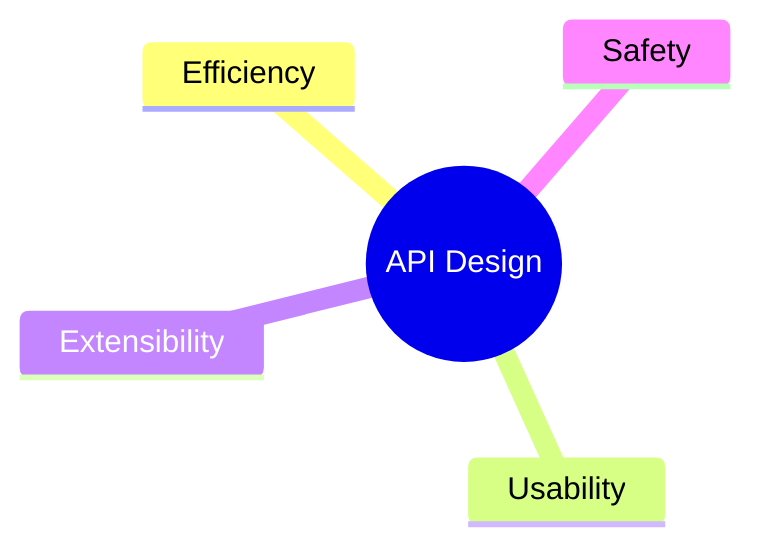

---
# try also 'default' to start simple
theme: dracula
# random image from a curated Unsplash collection by Anthony
# like them? see https://unsplash.com/collections/94734566/slidev
# TODO
# background: https://source.unsplash.com/collection/94734566/1920x1080
# https://sli.dev/custom/highlighters.html
highlighter: shiki
# show line numbers in code blocks
lineNumbers: true
# some information about the slides, markdown enabled
# TODO
info: |
  Why are you reading this?
# persist drawings in exports and build
drawings:
  persist: true
# use UnoCSS
# css: unocss
# page transition
transition: instant
# apply any windi css classes to the current slide
class: 'text-center'
# since the canvas gets smaller, the visual size will become larger
canvasWidth: 800
---

# Designing Robust APIs

**How to Write C++ Code that's Safe, Extensible, Efficient & Easy to Use**

<!-- --------------------------------------------------------------------------------------------------------- -->
---
layout: image-left
image: me.jpg
---

## Обо мне

- Пишу на C++ больше 15 лет.
- Основал WG21 Russia в 2016 вместе с [@apolukhin](https://github.com/apolukhin).
- В 2016-2019 представлял предложения от РФ в комитете.
- Руководил разработкой поискового движка в Яндексе.
- Руководил инфраструктурой, поиском и ML в Озоне.

<div class="text-gray-500 text-xs absolute bottom-0 right-0"><SlideCurrentNo/> / <SlidesTotal/></div>
<!-- --------------------------------------------------------------------------------------------------------- -->
---
layout: full
---

## Для кого этот доклад?

<br/>

- Для тех, кто пишет библиотечный код.
- Для тех, чей код так или иначе будет долго жить или широко использоваться.
- Для тех, кто хочет писать код, которым приятно пользоваться.

<br/>

```cpp {all}
class Buffer {
public:
    Buffer(const char *data, size_t size);

    Buffer(const Buffer &buffer)
        : Data_(nullptr)
        , Len_(0)
        , Pos_(0)
    {
        *this = buffer;
    }

    // ...
}
```

<div class="text-gray-500 text-xs absolute bottom-0 right-0"><SlideCurrentNo/> / <SlidesTotal/></div>
<!-- --------------------------------------------------------------------------------------------------------- -->
---
layout: center
---

<div style="transform: scale(1.5) translate(150px, 0px);">

</div>

<div style="transform: translate(0px, 70px);" class="text-2xl">
Хороший API находит баланс между всеми этими аспектами.
</div>

<div class="text-gray-500 text-xs absolute bottom-0 right-0"><SlideCurrentNo/> / <SlidesTotal/></div>
<!-- 
Я на протяжении своей карьеры много думал о том, какой код я пишу, и пришел к выводу что API дизайн 
является одной из ключевых вещей в разработке. 

Каждый раз когда вы думаете об эффективности, удобстве использования, безопасности или расширяемости 
вашего кода, вы думаете и об API, которое вы предоставляете пользователям.

И от выбора API зависит, сможете ли вы сделать свой код достаточно эффективным, безопасным, расширяемым...

<<<
-->
---
---

## Почему это важно?

[The Wonderfully Terrible World of C and C++ Encoding APIs](https://thephd.dev/the-c-c++-rust-string-text-encoding-api-landscape):

<table>
  <tbody>
    <tr>
      <td>Feature Set 👇 vs. Library 👉</td>
      <td>boost.text</td>
      <td>utf8cpp</td>
      <td>Standard C</td>
      <td>Standard C++</td>
      <td>Windows API</td>
    </tr>
    <tr>
      <td>Handles Legacy Encodings</td>
      <td>❌</td>
      <td>❌</td>
      <td>🤨</td>
      <td>🤨</td>
      <td>✅</td>
    </tr>
    <tr>
      <td>Handles UTF Encodings</td>
      <td>✅</td>
      <td>✅</td>
      <td>🤨</td>
      <td>🤨</td>
      <td>✅</td>
    </tr>
    <tr>
      <td>Bounded and Safe Conversion API</td>
      <td>❌</td>
      <td>❌</td>
      <td>🤨</td>
      <td>✅</td>
      <td>✅</td>
    </tr>
    <tr>
      <td>Assumed Valid Conversion API</td>
      <td>✅</td>
      <td>✅</td>
      <td>❌</td>
      <td>❌</td>
      <td>❌</td>
    </tr>
    <tr>
      <td>Unbounded Conversion API</td>
      <td>✅</td>
      <td>✅</td>
      <td>❌</td>
      <td>❌</td>
      <td>✅</td>
    </tr>
    <tr>
      <td>Counting API</td>
      <td>❌</td>
      <td>🤨</td>
      <td>❌</td>
      <td>❌</td>
      <td>✅</td>
    </tr>
    <tr>
      <td>Validation API</td>
      <td>❌</td>
      <td>🤨</td>
      <td>❌</td>
      <td>❌</td>
      <td>❌</td>
    </tr>
    <tr>
      <td>Bulk Conversions</td>
      <td>✅</td>
      <td>✅</td>
      <td>🤨</td>
      <td>🤨</td>
      <td>✅</td>
    </tr>
    <tr>
      <td>Single Conversions</td>
      <td>✅</td>
      <td>✅</td>
      <td>✅</td>
      <td>✅</td>
      <td>❌</td>
    </tr>
    <tr>
      <td>Custom Error Handling</td>
      <td>❌</td>
      <td>✅</td>
      <td>✅</td>
      <td>✅</td>
      <td>❌</td>
    </tr>
    <tr>
      <td>Updates Input Range (How Much Read™)</td>
      <td>✅</td>
      <td>❌</td>
      <td>✅</td>
      <td>✅</td>
      <td>❌</td>
    </tr>
    <tr>
      <td>Updates Output Range (How Much Written™)</td>
      <td>✅</td>
      <td>✅</td>
      <td>✅</td>
      <td>✅</td>
      <td>❌</td>
    </tr>
  </tbody>
</table>

> - Standard C: it’s <span class="text-red-600  ">trash</span>.
> - Standard C++: provides next-to-nothing of its own that is not sourced from C, and when it does it somehow makes it worse. <span class="text-red-600">Also trash</span>. 

<style>
.slidev-layout { td {
    font-size: 14px !important;
    padding: 2px;
    padding-top: 2px;
    padding-bottom: 2px;
}}
</style>

<div class="text-gray-500 text-xs absolute bottom-0 right-0"><SlideCurrentNo/> / <SlidesTotal/></div>
<!-- 
Почему это важно?

Например потому что на дворе 2023й а в С++ все еще нет нормального API для работы с энкодингами и Юникодом.

Почитайте блог этого товарища, ник thephd, расшифровывается как the phantom derpstorm, что бы это ни значило. 

Он пишет Sol3, биндинги для LUA, и участвует в стандартизации.

<<<
-->
---
---

## Почему это важно?

[Exploiting aCropalypse: Recovering Truncated PNGs](https://www.da.vidbuchanan.co.uk/blog/exploiting-acropalypse.html):
<blockquote>
<p><strong>SimonTime</strong> — 2023-01-02 15:28</p>
<p>so basically the pixel 7 pro, when you crop and save a screenshot, overwrites the image with the new version, but leaves the rest of the original file in its place</p>
</blockquote>
<blockquote>
<p><strong>Retr0id</strong> — 2023-01-02 15:28</p>
<p>ohhhhhhh wow</p>
</blockquote>
<blockquote>
<p><strong>SimonTime</strong> — 2023-01-02 15:28</p>
<p>so if you were to take a screenshot of an app which shows your address on screen, then crop it, if you could recover the information somehow that's a big deal</p>
</blockquote>

> ...

> IMHO, the takeaway here is that API footguns should be treated as security vulnerabilities.

См. [Back to Basics: C++ API Design - CppCon 2022](https://www.youtube.com/watch?v=zL-vn_pGGgY) by [Jason Turner
](https://github.com/lefticus).

<div class="text-gray-500 text-xs absolute bottom-0 right-0"><SlideCurrentNo/> / <SlidesTotal/></div>
<!-- 
Еще один пример.

В Android был кривой API сделанный по образу и подобию fopen. 

Этот API криво поменяли, изменения никто не заметил, и после этого если вы обрезали скрин на котором был ваш адрес, но адрес с ненулевой вероятностью все еще можно было восстановить из итогового файла.

Я подробно не буду останавливаться, так как там внутри по сути fopen, и про fopen очень хорошо рассказал Джейсон Тюрнер. Рекомендую его доклад с cppcon 2022.

Но если бы API было более нормальным, то проблем бы скорее всего не возникло.
 -->
---
---

## Rule #1:
### **Проектируйте API так, чтобы его нельзя было использовать неправильно**

<br/>

- Программа должна или работать корректно, или завершаться с ошибкой.
- Не должно существовать последовательности вызовов, которая приводит вашу программу в некорректное состояние.
- Чем меньше у вашего API способов завершиться с ошибкой — тем лучше. Зачем обрабатывать ошибки, если можно спроектировать API, в котором их нет?

<div class="text-gray-500 text-xs absolute bottom-0 right-0"><SlideCurrentNo/> / <SlidesTotal/></div>
<!-- 
Первое и главное правило API дизайна:

<<<
-->
---
---

```cpp {all}
struct CsvStats {
    DateTime startTime;
    DateTime endTime;
    // ...
};

class CsvDb {
public:
    explicit CsvDb(std::string_view path);

    std::string path(std::string_view tableName);

    CsvStats stats(std::string_view tableName);
    void setStats(std::string_view tableName, CsvStats stats);
};
```

<div class="text-gray-500 text-xs absolute bottom-0 right-0"><SlideCurrentNo/> / <SlidesTotal/></div>
<!-- 
Перейдем к примерам.

Бекграунд. Вы пишете какую-то ML автоматизацию, и как положено у вас куча разных данных, они или в CSV или в паркетах, предположим что вам повезло меньше и в вашем случае все в CSV. 

И вам надо сделать прослойку, чтобы удобно с этими данными работать из окружающего кода. 

Приложение stateful, CSV обновляются, все дела.

Что здесь происходит... [листать]
-->
---
---

```cpp {1-5}
struct CsvStats {
    DateTime startTime; 
    DateTime endTime;   // Some per-table aggregates: start & end time,
    // ...              // maybe per-column min, max & mean values.
};

class CsvDb {
public:
    explicit CsvDb(std::string_view path);

    std::string path(std::string_view tableName);

    CsvStats stats(std::string_view tableName);
    void setStats(std::string_view tableName, CsvStats stats);
};
```

<div class="text-gray-500 text-xs absolute bottom-0 right-0"><SlideCurrentNo/> / <SlidesTotal/></div>
<!-- --------------------------------------------------------------------------------------------------------- -->
---
---

```cpp {9}
struct CsvStats {
    DateTime startTime;
    DateTime endTime;
    // ...
};

class CsvDb {
public:
    explicit CsvDb(std::string_view path); // Path do data folder.

    std::string path(std::string_view tableName);

    CsvStats stats(std::string_view tableName);
    void setStats(std::string_view tableName, CsvStats stats);
};
```

<div class="text-gray-500 text-xs absolute bottom-0 right-0"><SlideCurrentNo/> / <SlidesTotal/></div>
<!-- --------------------------------------------------------------------------------------------------------- -->
---
---

```cpp {11-12}
struct CsvStats {
    DateTime startTime;
    DateTime endTime;
    // ...
};

class CsvDb {
public:
    explicit CsvDb(std::string_view path);

    std::string path(std::string_view tableName); // Returns path to table CSV for reading
                                                  // OR writing / replacing.
    CsvStats stats(std::string_view tableName);
    void setStats(std::string_view tableName, CsvStats stats);
};
```

<div class="text-gray-500 text-xs absolute bottom-0 right-0"><SlideCurrentNo/> / <SlidesTotal/></div>
<!-- --------------------------------------------------------------------------------------------------------- -->
---
---

```cpp {13-15}
struct CsvStats {
    DateTime startTime;
    DateTime endTime;
    // ...
};

class CsvDb {
public:
    explicit CsvDb(std::string_view path);

    std::string path(std::string_view tableName);

    CsvStats stats(std::string_view tableName);                // Getter & setter for stats.
    void setStats(std::string_view tableName, CsvStats stats); // Stats are stored in db.info,
};                                                             // and flushed on setStats.
```

<div class="text-gray-500 text-xs absolute bottom-0 right-0"><SlideCurrentNo/> / <SlidesTotal/></div>
<!-- --------------------------------------------------------------------------------------------------------- -->
---
---

```cpp {14}
struct CsvStats {
    DateTime startTime;
    DateTime endTime;
    // ...
};

class CsvDb {
public:
    explicit CsvDb(std::string_view path);

    std::string path(std::string_view tableName);

    CsvStats stats(std::string_view tableName);
    void setStats(std::string_view tableName, CsvStats stats); // Is this safe?
};
```

<div class="text-gray-500 text-xs absolute bottom-0 right-0"><SlideCurrentNo/> / <SlidesTotal/></div>
<!-- 
<<<

На самом деле не очень безопасный подход, потому что кто знает как там клиенты нашего кода насчитают эти агрегаты. 

Да и подменять таблицу и ее статистику хорошо бы атомарно, потому что одно без другого не бывает. Это должно навести вас на мысль!
-->
---
---

```cpp {14-15}
struct CsvStats {
    DateTime startTime;
    DateTime endTime;
    // ...
};

class CsvDb {
public:
    explicit CsvDb(std::string_view path);

    std::string path(std::string_view tableName);

    CsvStats stats(std::string_view tableName);
    void replace(std::string_view tableName, std::string_view newPath, 
                 CsvStats newStats); // Safer!
};
```

<div class="text-gray-500 text-xs absolute bottom-0 right-0"><SlideCurrentNo/> / <SlidesTotal/></div>
<!-- 
<<<

Вроде стало лучше, но все еще криво.

Статистику надо насчитывать клиенту. Можно лучше!
-->
---
---

```cpp {11,14}
struct CsvStats {
    DateTime startTime;
    DateTime endTime;
    // ...
};

class CsvDb {
public:
    explicit CsvDb(std::string_view path);

    CsvReader open(std::string_view tableName);

    CsvStats stats(std::string_view tableName);
    CsvWriter replace(std::string_view tableName); // WAY safer!
};
```

<div class="text-gray-500 text-xs absolute bottom-0 right-0"><SlideCurrentNo/> / <SlidesTotal/></div>
<!-- 
<<<

В таком варианте API клиенту не нужно самому считать статистики.

И из нашего API не торчат наружу пути до файлов, то есть клиент сам не работает с ФС.
-->
---
---

```cpp {9}
struct CsvStats {
    DateTime startTime;
    DateTime endTime;
    // ...
};

class CsvDb {
public:
    explicit CsvDb(std::filesystem::path path); // Use std::filesystem::path for paths!

    CsvReader open(std::string_view tableName);

    CsvStats stats(std::string_view tableName);
    CsvWriter replace(std::string_view tableName);
};
```

<div class="text-gray-500 text-xs absolute bottom-0 right-0"><SlideCurrentNo/> / <SlidesTotal/></div>
<!-- --------------------------------------------------------------------------------------------------------- -->
---
---

<br/>
<br/>

<div align="center">VS</div>

<br/>

<div grid="~ cols-2 gap-2" m="-t-2">

```cpp {all}
struct CsvStats {
    DateTime startTime;
    DateTime endTime;
    // ...
};

class CsvDb {
public:
    explicit CsvDb(std::string_view path);

    std::string path(std::string_view tableName);

    CsvStats stats(std::string_view tableName);
    void setStats(std::string_view tableName, 
                  CsvStats stats);
};
```

```cpp {all}
struct CsvStats {
    DateTime startTime;
    DateTime endTime;
    // ...
};

class CsvDb {
public:
    explicit CsvDb(std::filesystem::path path);

    CsvReader open(std::string_view tableName);
    CsvWriter replace(std::string_view tableName);

    CsvStats stats(std::string_view tableName);
    
};
```

</div>

<style>
.slidev-layout { pre, code {
    font-size: 10px !important;
    line-height: 14px !important;
}}
</style>

<div class="text-gray-500 text-xs absolute bottom-0 right-0"><SlideCurrentNo/> / <SlidesTotal/></div>
<!--
Новый API ближе к сути происходящего.

Видно по парам геттеров-сеттеров. Раньше АПИ было вокруг статистик, теперь оно вокруг таблиц, что лучше отражает суть происходящего.

open/replace это по сути новые getter/setter.
-->
---
---

```cpp {all}
class Window {
public:
    void setTitle(const std::string &title);
    std::string title() const;

    void resize(const Size &size);
    Size size() const;

    void setPosition(const Point &point);
    Point position();

    // ...

    void initOpenGL();
    void bindContext();
    void swapBuffers();
}
```

<div class="text-gray-500 text-xs absolute bottom-0 right-0"><SlideCurrentNo/> / <SlidesTotal/></div>
<!-- 
Еще один пример.

Предположим что вы живете двойной жизнью.

В одной жизни вы программист в крупной уважаемой компании, и пишете ML автоматизацию.

У вас есть медицинская страховка, вы платите налоги, и еще --- помогаете консьержке выносить мусор.

Другая ваша жизнь --- в компьютерных играх. Вы делаете моды, и пишете свою игру вместе с группой единомышленников.

И вам нужна абстракция окна.

И в этом окне вы будете что-то рисовать через OpenGL.
-->
---
---

```cpp {3-10}
class Window {
public:
    void setTitle(const std::string &title);    //
    std::string title() const;                  //
                                                //
    void resize(const Size &size);              // Window properties...
    Size size() const;                          //
                                                //
    void setPosition(const Point &point);       //
    Point position();                           //

    // ...

    void initOpenGL();
    void bindContext();
    void swapBuffers();
}
```

<div class="text-gray-500 text-xs absolute bottom-0 right-0"><SlideCurrentNo/> / <SlidesTotal/></div>
<!-- --------------------------------------------------------------------------------------------------------- -->
---
---

```cpp {14}
class Window {
public:
    void setTitle(const std::string &title);
    std::string title() const; 
       
    void resize(const Size &size); 
    Size size() const;
       
    void setPosition(const Point &point);
    Point position();   

    // ...

    void initOpenGL(); // Initializes OpenGL context for this Window.
    void bindContext();
    void swapBuffers();
}
```

<div class="text-gray-500 text-xs absolute bottom-0 right-0"><SlideCurrentNo/> / <SlidesTotal/></div>
<!-- --------------------------------------------------------------------------------------------------------- -->
---
---

```cpp {15}
class Window {
public:
    void setTitle(const std::string &title);
    std::string title() const; 
       
    void resize(const Size &size); 
    Size size() const;
       
    void setPosition(const Point &point);
    Point position();   

    // ...

    void initOpenGL(); 
    void bindContext(); // Binds this Window's context for the current thread.
    void swapBuffers();
}
```

<div class="text-gray-500 text-xs absolute bottom-0 right-0"><SlideCurrentNo/> / <SlidesTotal/></div>
<!-- --------------------------------------------------------------------------------------------------------- -->
---
---

```cpp {16}
class Window {
public:
    void setTitle(const std::string &title);
    std::string title() const; 
       
    void resize(const Size &size); 
    Size size() const;
       
    void setPosition(const Point &point);
    Point position();   

    // ...

    void initOpenGL(); 
    void bindContext();
    void swapBuffers(); // Swaps buffers & starts next frame.
}
```

<div class="text-gray-500 text-xs absolute bottom-0 right-0"><SlideCurrentNo/> / <SlidesTotal/></div>
<!-- --------------------------------------------------------------------------------------------------------- -->
---
---

```cpp {15-16}
class Window {
public:
    void setTitle(const std::string &title);
    std::string title() const; 
       
    void resize(const Size &size); 
    Size size() const;
       
    void setPosition(const Point &point);
    Point position();   

    // ...

    void initOpenGL(); 
    void bindContext(); // OOPS: assert(_glInitialized); inside.
    void swapBuffers(); // Can only be called after a call to initOpenGL().
}
```

<div class="text-gray-500 text-xs absolute bottom-0 right-0"><SlideCurrentNo/> / <SlidesTotal/></div>
<!--
<<<

Есть простой способ поправить это --- перенести initOpenGL в конструктор. 

Предположим что мы не можем это сделать. Причины могут быть разные.

Что еще можно сделать?
-->
---
---

```cpp {14,17-23}
class Window {
public:
    void setTitle(const std::string &title);
    std::string title() const;

    void resize(const Size &size);
    Size size() const;

    void setPosition(const Point &point);
    Point position();

    // ...

    std::unique_ptr<OpenGLContext> createOpenGLContext();
};

class OpenGLContext {
public:
    void bind();
    void swapBuffers();

    // ...
}
```

<div class="text-gray-500 text-xs absolute bottom-0 right-0"><SlideCurrentNo/> / <SlidesTotal/></div>
<!-- 
<<<

Так и код проще потому что у окна меньше стейта теперь.

И теперь не создав контекст просто нельзя вызывать связанные с opengl методы.

И на самом деле такой код лучше отражает суть нижележащих концепций. 

У одного окна действительно может быть несколько opengl контекстов.
-->
---
---

## Rule #2:
### **Divide & Conquer: Дробите!**

<br/>

- Помните про S in SOLID. \
  *"The Single-responsibility principle: There should never be more than one reason for a class to change."*
- Количество возможных взаимодействий (и багов) внутри класса растет как квадрат от размера класса. Меньше классы — меньше проблем!
- Мелкие классы легче читать и осознавать.
- Аналогично работает и с библиотеками. Классы в "помойке классов" начинают зависеть друг от друга, снова квадрат зависимостей и баги. Дробите на более мелкие библиотеки!
- Эта же логика применима к функциям.

<div class="text-gray-500 text-xs absolute bottom-0 right-0"><SlideCurrentNo/> / <SlidesTotal/></div>
<!-- 
Эти примеры приводят нас ко второму правилу API дизайна.

Дробите свой код на кусочки.

<<<
-->
---
---

```cpp {all}
void parseStrings(const Buffer &buffer, std::vector<std::string> *result) { // Parses a buffer of null-terminated
    size_t pos = 0;                                                         // strings.
    while (pos < buffer.size()) {
        const char *nextPos = static_cast<const char *>(memchr(buffer.data() + pos, '\0', buffer.size() - pos));
        size_t size = (nextPos ? nextPos - buffer.data() : buffer.size()) - pos;
        std::string str = std::string(buffer.data() + pos, size);

        if (str.size() >= 2 && str.front() == '"' && str.back() == '"')
            str = str.substr(1, str.size() - 2);

        result->push_back(std::move(str));
        pos += size;
    }
}
```

<style>
.slidev-layout { pre, code {
    font-size: 10px !important;
    line-height: 14px !important;
}}
</style>

<div class="text-gray-500 text-xs absolute bottom-0 right-0"><SlideCurrentNo/> / <SlidesTotal/></div>
<!--
Продолжим про игру. 

Данные вашей игры лежат в файлах, и строки тоже. 

И вы почему-то решили сложить все строки просто одна за другой, разделив их нулл-терминаторами. 

Почему так? Не спрашивайте, может быть на дворе 90е, может еще что.

И теперь вы написали фукнцию которая такой файл парсит и складывает строки в вектор.

Вы подобный код наверняка видели не одну сотню раз.
-->
---
---

```cpp {3-4}
void parseStrings(const Buffer &buffer, std::vector<std::string> *result) {
    size_t pos = 0;
    while (pos < buffer.size()) { // Find next null terminator ↓
        const char *nextPos = static_cast<const char *>(memchr(buffer.data() + pos, '\0', buffer.size() - pos));
        size_t size = (nextPos ? nextPos - buffer.data() : buffer.size()) - pos;
        std::string str = std::string(buffer.data() + pos, size);

        if (str.size() >= 2 && str.front() == '"' && str.back() == '"')
            str = str.substr(1, str.size() - 2);

        result->push_back(std::move(str));
        pos += size;
    }
}
```

<style>
.slidev-layout { pre, code {
    font-size: 10px !important;
    line-height: 14px !important;
}}
</style>

<div class="text-gray-500 text-xs absolute bottom-0 right-0"><SlideCurrentNo/> / <SlidesTotal/></div>
<!-- --------------------------------------------------------------------------------------------------------- -->
---
---

```cpp {5-6}
void parseStrings(const Buffer &buffer, std::vector<std::string> *result) {
    size_t pos = 0;
    while (pos < buffer.size()) {
        const char *nextPos = static_cast<const char *>(memchr(buffer.data() + pos, '\0', buffer.size() - pos));
        size_t size = (nextPos ? nextPos - buffer.data() : buffer.size()) - pos;
        std::string str = std::string(buffer.data() + pos, size); // Extract next string.

        if (str.size() >= 2 && str.front() == '"' && str.back() == '"')
            str = str.substr(1, str.size() - 2);

        result->push_back(std::move(str));
        pos += size;
    }
}
```

<style>
.slidev-layout { pre, code {
    font-size: 10px !important;
    line-height: 14px !important;
}}
</style>

<div class="text-gray-500 text-xs absolute bottom-0 right-0"><SlideCurrentNo/> / <SlidesTotal/></div>
<!-- --------------------------------------------------------------------------------------------------------- -->
---
---

```cpp {8-9}
void parseStrings(const Buffer &buffer, std::vector<std::string> *result) {
    size_t pos = 0;
    while (pos < buffer.size()) {
        const char *nextPos = static_cast<const char *>(memchr(buffer.data() + pos, '\0', buffer.size() - pos));
        size_t size = (nextPos ? nextPos - buffer.data() : buffer.size()) - pos;
        std::string str = std::string(buffer.data() + pos, size);

        if (str.size() >= 2 && str.front() == '"' && str.back() == '"')
            str = str.substr(1, str.size() - 2); // Unquote a string if it's quoted.

        result->push_back(std::move(str));
        pos += size;
    }
}
```

<style>
.slidev-layout { pre, code {
    font-size: 10px !important;
    line-height: 14px !important;
}}
</style>

<div class="text-gray-500 text-xs absolute bottom-0 right-0"><SlideCurrentNo/> / <SlidesTotal/></div>
<!-- --------------------------------------------------------------------------------------------------------- -->
---
---

```cpp {11-12}
void parseStrings(const Buffer &buffer, std::vector<std::string> *result) {
    size_t pos = 0;
    while (pos < buffer.size()) {
        const char *nextPos = static_cast<const char *>(memchr(buffer.data() + pos, '\0', buffer.size() - pos));
        size_t size = (nextPos ? nextPos - buffer.data() : buffer.size()) - pos;
        std::string str = std::string(buffer.data() + pos, size);

        if (str.size() >= 2 && str.front() == '"' && str.back() == '"')
            str = str.substr(1, str.size() - 2);

        result->push_back(std::move(str)); // Write results &
        pos += size;                       // prepare to parse the next string.
    }
}
```

<style>
.slidev-layout { pre, code {
    font-size: 10px !important;
    line-height: 14px !important;
}}
</style>

<div class="text-gray-500 text-xs absolute bottom-0 right-0"><SlideCurrentNo/> / <SlidesTotal/></div>
<!-- --------------------------------------------------------------------------------------------------------- -->
---
---

```cpp {12}
void parseStrings(const Buffer &buffer, std::vector<std::string> *result) {
    size_t pos = 0;
    while (pos < buffer.size()) {
        const char *nextPos = static_cast<const char *>(memchr(buffer.data() + pos, '\0', buffer.size() - pos));
        size_t size = (nextPos ? nextPos - buffer.data() : buffer.size()) - pos;
        std::string str = std::string(buffer.data() + pos, size);

        if (str.size() >= 2 && str.front() == '"' && str.back() == '"')
            str = str.substr(1, str.size() - 2);

        result->push_back(std::move(str));
        pos += size; // BUG: should be pos += size + 1.
    }
}
```

<style>
.slidev-layout { pre, code {
    font-size: 10px !important;
    line-height: 14px !important;
}}
</style>

<div class="text-gray-500 text-xs absolute bottom-0 right-0"><SlideCurrentNo/> / <SlidesTotal/></div>
<!--
<<<

Можно ли этот код написать проще, и чтобы вообще не было возможности посадить баг?

Конечно можно.

Я сразу покажу возможное решение.
-->
---
---

```cpp
void parseStrings(const Buffer &buffer, std::vector<std::string> *result) {
    size_t pos = 0;
    while (pos < buffer.size()) {
        const char *nextPos = static_cast<const char *>(memchr(buffer.data() + pos, '\0', buffer.size() - pos));
        size_t size = (nextPos ? nextPos - buffer.data() : buffer.size()) - pos;
        std::string str = std::string(buffer.data() + pos, size);

        if (str.size() >= 2 && str.front() == '"' && str.back() == '"')
            str = str.substr(1, str.size() - 2);

        result->push_back(std::move(str));
        pos += size + 1;
    }
}
```

<br/>
<div align="center">VS</div>
<br/>

```cpp
void parseStrings(const Buffer &buffer, std::vector<std::string> *result) {
    MemoryInput input(buffer);

    std::string line;
    while (input.readLine(&line, '\0'))
        result->push_back(unquote(line));
}
```

<style>
.slidev-layout { pre, code {
    font-size: 10px !important;
    line-height: 14px !important;
}}
</style>

<div class="text-gray-500 text-xs absolute bottom-0 right-0"><SlideCurrentNo/> / <SlidesTotal/></div>
<!-- --------------------------------------------------------------------------------------------------------- -->
---
---

```cpp {3-6,12}
void parseStrings(const Buffer &buffer, std::vector<std::string> *result) {
    size_t pos = 0;
    while (pos < buffer.size()) {
        const char *nextPos = static_cast<const char *>(memchr(buffer.data() + pos, '\0', buffer.size() - pos));
        size_t size = (nextPos ? nextPos - buffer.data() : buffer.size()) - pos;
        std::string str = std::string(buffer.data() + pos, size);

        if (str.size() >= 2 && str.front() == '"' && str.back() == '"')
            str = str.substr(1, str.size() - 2);

        result->push_back(std::move(str));
        pos += size + 1;
    }
}
```

<br/>
<div align="center">VS</div>
<br/>

```cpp {5}
void parseStrings(const Buffer &buffer, std::vector<std::string> *result) {
    MemoryInput input(buffer);

    std::string line;
    while (input.readLine(&line, '\0'))
        result->push_back(unquote(line));
}
```

<style>
.slidev-layout { pre, code {
    font-size: 10px !important;
    line-height: 14px !important;
}}
</style>

<div class="text-gray-500 text-xs absolute bottom-0 right-0"><SlideCurrentNo/> / <SlidesTotal/></div>
<!-- 
Мы добавили абстракцию MemoryInput.

...
-->
---
---

```cpp {8-11}
void parseStrings(const Buffer &buffer, std::vector<std::string> *result) {
    size_t pos = 0;
    while (pos < buffer.size()) {
        const char *nextPos = static_cast<const char *>(memchr(buffer.data() + pos, '\0', buffer.size() - pos));
        size_t size = (nextPos ? nextPos - buffer.data() : buffer.size()) - pos;
        std::string str = std::string(buffer.data() + pos, size);

        if (str.size() >= 2 && str.front() == '"' && str.back() == '"')
            str = str.substr(1, str.size() - 2);

        result->push_back(std::move(str));
        pos += size + 1;
    }
}
```

<br/>
<div align="center">VS</div>
<br/>

```cpp {6}
std::vector<std::string> parseStrings(const Buffer &buffer, std::vector<std::string> *result) {
    MemoryInput input(buffer);

    std::string line;
    while (input.readLine(&line, '\0'))
        result->push_back(unquote(line));
}
```

<style>
.slidev-layout { pre, code {
    font-size: 10px !important;
    line-height: 14px !important;
}}
</style>

<div class="text-gray-500 text-xs absolute bottom-0 right-0"><SlideCurrentNo/> / <SlidesTotal/></div>
<!-- --------------------------------------------------------------------------------------------------------- -->
---
---

## Rule #2:
### **Divide & Conquer: Дробите!**

<br/>

- Как только видите сложный код — думайте, каких абстракций вам не хватает!
- Дробить — это еще и про слои абстракции!
- Если ваш код все еще сложный — дробите дальше!

<div class="text-gray-500 text-xs absolute bottom-0 right-0"><SlideCurrentNo/> / <SlidesTotal/></div>
<!-- --------------------------------------------------------------------------------------------------------- -->
---
---

```cpp {all}
template<class T>
class QFuture {
public:
    QFuture(const QFuture &other);

    const_iterator begin() const;
    const_iterator end() const;
    QList<T> results() const;

    void cancel();
    T takeResult();
    T result() const;

    auto then(Function &&function);
    auto then(QThreadPool *pool, Function &&function);
    auto then(QObject *context, Function &&function);

    bool isCanceled() const;
    bool isFinished() const;
    bool isRunning() const;
    bool isStarted() const;
    bool isValid() const;

    // ...
};
```

<div class="text-gray-500 text-xs absolute bottom-0 right-0"><SlideCurrentNo/> / <SlidesTotal/></div>
<!--
Но давайте посмотрим на еще один пример.

Это часть интерфейса класса QFuture из Qt, ну и это по сути прокачанный аналог std::future.

Абстракция над асинхронным вычислением.

<<<
-->
---
---

```cpp {4}
template<class T>
class QFuture {
public:
    QFuture(const QFuture &other); // QFuture is ref-counted.

    const_iterator begin() const;
    const_iterator end() const;
    QList<T> results() const;

    void cancel();
    T takeResult();
    T result() const;

    auto then(Function &&function);
    auto then(QThreadPool *pool, Function &&function);
    auto then(QObject *context, Function &&function);

    bool isCanceled() const;
    bool isFinished() const;
    bool isRunning() const;
    bool isStarted() const;
    bool isValid() const;

    // ...
};
```

<div class="text-gray-500 text-xs absolute bottom-0 right-0"><SlideCurrentNo/> / <SlidesTotal/></div>
<!-- --------------------------------------------------------------------------------------------------------- -->
---
---

```cpp {6-8}
template<class T>
class QFuture {
public:
    QFuture(const QFuture &other); 

    const_iterator begin() const; //
    const_iterator end() const;   // Async sequence interface.
    QList<T> results() const;     //

    void cancel();
    T takeResult();
    T result() const;

    auto then(Function &&function);
    auto then(QThreadPool *pool, Function &&function);
    auto then(QObject *context, Function &&function);

    bool isCanceled() const;
    bool isFinished() const;
    bool isRunning() const;
    bool isStarted() const;
    bool isValid() const;

    // ...
}
```

<div class="text-gray-500 text-xs absolute bottom-0 right-0"><SlideCurrentNo/> / <SlidesTotal/></div>
<!-- --------------------------------------------------------------------------------------------------------- -->
---
---

```cpp {10}
template<class T>
class QFuture {
public:
    QFuture(const QFuture &other); 

    const_iterator begin() const;
    const_iterator end() const;
    QList<T> results() const;

    void cancel(); // Built-in cancellation support! ^_^
    T takeResult();
    T result() const;

    auto then(Function &&function);
    auto then(QThreadPool *pool, Function &&function);
    auto then(QObject *context, Function &&function);

    bool isCanceled() const;
    bool isFinished() const;
    bool isRunning() const;
    bool isStarted() const;
    bool isValid() const;

    // ...
}
```

<div class="text-gray-500 text-xs absolute bottom-0 right-0"><SlideCurrentNo/> / <SlidesTotal/></div>
<!-- --------------------------------------------------------------------------------------------------------- -->
---
---

```cpp {11}
template<class T>
class QFuture {
public:
    QFuture(const QFuture &other); 

    const_iterator begin() const;
    const_iterator end() const;
    QList<T> results() const;

    void cancel();
    T takeResult(); // Waits for completion & moves out the result. Support for move-only types.
    T result() const;

    auto then(Function &&function);
    auto then(QThreadPool *pool, Function &&function);
    auto then(QObject *context, Function &&function);

    bool isCanceled() const;
    bool isFinished() const;
    bool isRunning() const;
    bool isStarted() const;
    bool isValid() const;

    // ...
}
```

<div class="text-gray-500 text-xs absolute bottom-0 right-0"><SlideCurrentNo/> / <SlidesTotal/></div>
<!-- --------------------------------------------------------------------------------------------------------- -->
---
---

```cpp {12}
template<class T>
class QFuture {
public:
    QFuture(const QFuture &other); 

    const_iterator begin() const;
    const_iterator end() const;
    QList<T> results() const;

    void cancel();
    T takeResult();
    T result() const; // Waits for completion & returns a copy of result.

    auto then(Function &&function);
    auto then(QThreadPool *pool, Function &&function);
    auto then(QObject *context, Function &&function);

    bool isCanceled() const;
    bool isFinished() const;
    bool isRunning() const;
    bool isStarted() const;
    bool isValid() const;

    // ...
}
```

<div class="text-gray-500 text-xs absolute bottom-0 right-0"><SlideCurrentNo/> / <SlidesTotal/></div>
<!-- --------------------------------------------------------------------------------------------------------- -->
---
---

```cpp {14-16}
template<class T>
class QFuture {
public:
    QFuture(const QFuture &other); 

    const_iterator begin() const;
    const_iterator end() const;
    QList<T> results() const;

    void cancel();
    T takeResult();
    T result() const;

    auto then(Function &&function);                    //
    auto then(QThreadPool *pool, Function &&function); // Continuations.
    auto then(QObject *context, Function &&function);  //

    bool isCanceled() const;
    bool isFinished() const;
    bool isRunning() const;
    bool isStarted() const;
    bool isValid() const;

    // ...
}
```

<div class="text-gray-500 text-xs absolute bottom-0 right-0"><SlideCurrentNo/> / <SlidesTotal/></div>
<!-- --------------------------------------------------------------------------------------------------------- -->
---
---

```cpp {14}
template<class T>
class QFuture {
public:
    QFuture(const QFuture &other); 

    const_iterator begin() const;
    const_iterator end() const;
    QList<T> results() const;

    void cancel();
    T takeResult();
    T result() const;

    auto then(Function &&function); // Where is this one run? It depends...
    auto then(QThreadPool *pool, Function &&function);
    auto then(QObject *context, Function &&function);

    bool isCanceled() const;
    bool isFinished() const;
    bool isRunning() const;
    bool isStarted() const;
    bool isValid() const;

    // ...
}
```

<div class="text-gray-500 text-xs absolute bottom-0 right-0"><SlideCurrentNo/> / <SlidesTotal/></div>
<!-- --------------------------------------------------------------------------------------------------------- -->
---
---

```cpp {16-17}
template<class T>
class QFuture {
public:
    QFuture(const QFuture &other); 

    const_iterator begin() const;
    const_iterator end() const;
    QList<T> results() const;

    void cancel();
    T takeResult();
    T result() const;

    auto then(Function &&function);
    auto then(QThreadPool *pool, Function &&function);
    auto then(QObject *context, Function &&function); // Unlike QObject::connect, this WILL CRASH 
                                                      // if you delete the context object.
    bool isCanceled() const;
    bool isFinished() const;
    bool isRunning() const;
    bool isStarted() const;
    bool isValid() const;

    // ...
}
```

<div class="text-gray-500 text-xs absolute bottom-0 right-0"><SlideCurrentNo/> / <SlidesTotal/></div>
<!-- --------------------------------------------------------------------------------------------------------- -->
---
---

```cpp {18-22}
template<class T>
class QFuture {
public:
    QFuture(const QFuture &other); 

    const_iterator begin() const;
    const_iterator end() const;
    QList<T> results() const;

    void cancel();
    T takeResult();
    T result() const;

    auto then(Function &&function);
    auto then(QThreadPool *pool, Function &&function);
    auto then(QObject *context, Function &&function);  
                                                      
    bool isCanceled() const; //
    bool isFinished() const; //
    bool isRunning() const;  // State observers (not all of them).
    bool isStarted() const;  //
    bool isValid() const;    //

    // ...
}
```

<div class="text-gray-500 text-xs absolute bottom-0 right-0"><SlideCurrentNo/> / <SlidesTotal/></div>
<!-- --------------------------------------------------------------------------------------------------------- -->
---
---

```cpp {20-21}
template<class T>
class QFuture {
public:
    QFuture(const QFuture &other); 

    const_iterator begin() const;
    const_iterator end() const;
    QList<T> results() const;

    void cancel();
    T takeResult();
    T result() const;

    auto then(Function &&function);
    auto then(QThreadPool *pool, Function &&function);
    auto then(QObject *context, Function &&function); 

    bool isCanceled() const;
    bool isFinished() const;
    bool isRunning() const;  // How are these two different?
    bool isStarted() const;  // Gotta read the sources to figure out...
    bool isValid() const;

    // ...
}
```

<div class="text-gray-500 text-xs absolute bottom-0 right-0"><SlideCurrentNo/> / <SlidesTotal/></div>
<!-- --------------------------------------------------------------------------------------------------------- -->
---
---

```cpp {18-22}
template<class T>
class QFuture {
public:
    QFuture(const QFuture &other); 

    const_iterator begin() const;
    const_iterator end() const;
    QList<T> results() const;

    void cancel();
    T takeResult();
    T result() const;

    auto then(Function &&function);
    auto then(QThreadPool *pool, Function &&function);
    auto then(QObject *context, Function &&function); 

    bool isCanceled() const; //
    bool isFinished() const; // Why do we even have all these state observers?
    bool isRunning() const;  // Why not a single State state() function?
    bool isStarted() const;  //
    bool isValid() const;    //

    // ...
}
```

<div class="text-gray-500 text-xs absolute bottom-0 right-0"><SlideCurrentNo/> / <SlidesTotal/></div>
<!--
[листать]
-->
---
---

```cpp {2,4,6-8,11-12,24}
template<class T>
class QWhatExactlyIsThisMonstrosity /* ¯\_(ツ)_/¯ */ {
public:
    QWhatExactlyIsThisMonstrosity(const QWhatExactlyIsThisMonstrosity &other); // Shared future?

    const_iterator begin() const;                       //
    const_iterator end() const;                         // Async sequence?
    QList<T> results() const;                           //

    void cancel();
    T takeResult();                                     // Not so shared future?
    T result() const;                                   // Shared future?

    auto then(Function &&function);
    auto then(QThreadPool *pool, Function &&function);
    auto then(QObject *context, Function &&function);   // (╯°□°)╯ 彡 ┻━┻

    bool isCanceled() const;
    bool isFinished() const;
    bool isRunning() const;
    bool isStarted() const;                             // (╯◉▃◉)╯ ︵ ┻━┻ 
    bool isValid() const;   

    // P.S.: Don't even try to read the sources. They'll give you nightmares.
}
```

<div class="text-gray-500 text-xs absolute bottom-0 right-0"><SlideCurrentNo/> / <SlidesTotal/></div>
<!--
Вот вы посмотрели на этот API.

И кажется у класса биполярочка (триполярочка?).

<<<

И если вы попробуете придумать название, которое будет хорошо отражать его функциональность, то у вас не получится.

И это должно заставить вас задуматься.
-->
---
---

## Rule #3:
### **Тратьте время на придумывание хороших имен!**

> "There are only two hard things in Computer Science: cache invalidation and naming things." — Phil Karlton

> “Clean code reads like well-written prose.” — Robert C. Martin

<br/>

* Если что-то не получается назвать нормально — значит вы хотите странного, переделывайте свой дизайн.
* Не поддавайтесь соблазну назвать класс <span class="font-mono">HandlerHelper</span>. Все, что заканчивается на <span class="font-mono">Helper</span> — это признание поражения.
* Думайте над тем, в чем вообще концептуальная суть ваших абстракций. \
  *"Что такое future?"*
* Пользуйтесь [thesaurus.com](https://www.thesaurus.com/) и [ChatGPT](http://chat.openai.com/).

<div class="text-gray-500 text-xs absolute bottom-0 right-0"><SlideCurrentNo/> / <SlidesTotal/></div>
<!--
Потому что нейминг очень важен.

И на придумывание хороших имен нужно тратить время.

<<<
-->
---
---

```cpp {2,4-7,12,14-16,21,23-25}
template<class T>
class QFuturePart1 {
public:
    void cancel();
    const_iterator begin() const;
    const_iterator end() const;
    QList<T> results() const;
    // ...
}

template<class T>
class QFuturePart2 {
public:
    QFuture(const QFuture &other); 
    void cancel();
    T result() const;
    // ...
}

template<class T>
class QFuturePart3 {
public:
    QFuture(QFuture &&other); 
    void cancel();
    T takeResult();
    // ...
}
```

<style>
.slidev-layout { pre, code {
    font-size: 10px !important;
    line-height: 14px !important;
}}
</style>

<div class="text-gray-500 text-xs absolute bottom-0 right-0"><SlideCurrentNo/> / <SlidesTotal/></div>
<!-- --------------------------------------------------------------------------------------------------------- -->
---
---

```cpp {2,4-7,12,14-16,21,23-25}
template<class T>
class QGenerator {
public:
    void cancel();
    const_iterator begin() const;
    const_iterator end() const;
    QList<T> results() const;
    // ...
}

template<class T>
class QSharedFuture {
public:
    QFuture(const QFuture &other); 
    void cancel();
    T result() const;
    // ...
}

template<class T>
class QUniqueFuture {
public:
    QFuture(QFuture &&other); 
    void cancel();
    T takeResult();
    // ...
}
```

<style>
.slidev-layout { pre, code {
    font-size: 10px !important;
    line-height: 14px !important;
}}
</style>

<div class="text-gray-500 text-xs absolute bottom-0 right-0"><SlideCurrentNo/> / <SlidesTotal/></div>
<!-- 
<<<

Важно что мы к этому пришли думая не о классах, а о том, в чем вообще их суть.

О том, какие абстракции они описывают.
-->
---
---

## Rule #2 + Rule #3:
### **Дробление и нейминг — это про абстракции, а не про классы!**

<br/>

* Ваш код — это перевод абстракций в вашей голове на С++.
* Если в голове нет порядка, то в коде его тоже не будет.

<br/>

Что такое future?
* Это абстракция над вычислением.
* Но это и абстракция над контекстом, в котором это вычисление производится!

```cpp
template<class T>
class QSharedFuture {
public:
    auto then(Function &&function); // Where will it run?
                                    // Can I pass in a function that does a lot of work?
    // ...                          // Can we do better?
};

```

<div class="text-gray-500 text-xs absolute bottom-0 right-0"><SlideCurrentNo/> / <SlidesTotal/></div>
<!-- 
И это важная мысль.

Дробление и нейминг — это про абстракции, а не про классы!

В целом API дизайн это про абстракции.

<<<

Futures как они есть это просто пример плохого API. 

У меня лично не получилось нормально заюзать std::future ни в одном проекте, приходилось велосипедить. 

Аналогичная ситуация с QFuture --- очень тяжело пользоваться.

Features это просто плохая абстрация.

[листать]
-->
---
---

```cpp {all}

Task<TwitterPosts> fetchTwitterPosts(Network &network, const TwitterFetchOptions &opts) {
    return network
        .request(makeNetworkRequest(opts))
        .then([](std::string_view jsonData) {
            TwitterPosts result;
            deserialize(Json::parse(jsonData), &result);
            return result;
        });
}

void myAwesomeFunction(Network &network) {
    TwitterPosts posts = fetchTwitterPosts(network, TwitterFetchOptions("@stroustrup", 20))
        .run(globalThreadPool())
        .join();
    std::print("{}", posts);
}

```

<div class="text-gray-500 text-xs absolute bottom-0 right-0"><SlideCurrentNo/> / <SlidesTotal/></div>
<!--
Ладно, поругали features, давайте подумаем, а какой API мы вообще хотим на замену features?

Бекграунд тут примерно такой - вы продолжаете писать ML автоматизацию, 
и вам нужно добавить в свои данные посты из твиттера.

И вот вы придумали хороший асинхронный API. И теперь скачиваете последние посты Бьярни.
-->
---
---

```cpp {1-2}
// Returns a Task that will fetch twitter posts with the provided options when run.
Task<TwitterPosts> fetchTwitterPosts(Network &network, const TwitterFetchOptions &opts) {
    return network
        .request(makeNetworkRequest(opts))
        .then([](std::string_view jsonData) {
            TwitterPosts result;
            deserialize(Json::parse(jsonData), &result);
            return result;
        });
}

void myAwesomeFunction(Network &network) {
    TwitterPosts posts = fetchTwitterPosts(network, TwitterFetchOptions("@stroustrup", 20))
        .run(globalThreadPool())
        .join();
    std::print("{}", posts);
}
```

<div class="text-gray-500 text-xs absolute bottom-0 right-0"><SlideCurrentNo/> / <SlidesTotal/></div>
<!-- --------------------------------------------------------------------------------------------------------- -->
---
---

```cpp {4}

Task<TwitterPosts> fetchTwitterPosts(Network &network, const TwitterFetchOptions &opts) {
    return network
        .request(makeNetworkRequest(opts)) // Network::request() also returns a Task!
        .then([](std::string_view jsonData) {
            TwitterPosts result;
            deserialize(Json::parse(jsonData), &result);
            return result;
        });
}

void myAwesomeFunction(Network &network) {
    TwitterPosts posts = fetchTwitterPosts(network, TwitterFetchOptions("@stroustrup", 20))
        .run(globalThreadPool())
        .join();
    std::print("{}", posts);
}
```

<div class="text-gray-500 text-xs absolute bottom-0 right-0"><SlideCurrentNo/> / <SlidesTotal/></div>
<!-- --------------------------------------------------------------------------------------------------------- -->
---
---

```cpp {5-9}

Task<TwitterPosts> fetchTwitterPosts(Network &network, const TwitterFetchOptions &opts) {
    return network
        .request(makeNetworkRequest(opts))
        .then([](std::string_view jsonData) { // Tasks are composable!
            TwitterPosts result;              
            deserialize(Json::parse(jsonData), &result);
            return result;
        });
}

void myAwesomeFunction(Network &network) {
    TwitterPosts posts = fetchTwitterPosts(network, TwitterFetchOptions("@stroustrup", 20))
        .run(globalThreadPool())
        .join();
    std::print("{}", posts);
}
```

<div class="text-gray-500 text-xs absolute bottom-0 right-0"><SlideCurrentNo/> / <SlidesTotal/></div>
<!-- --------------------------------------------------------------------------------------------------------- -->
---
---

```cpp {12-13}

Task<TwitterPosts> fetchTwitterPosts(Network &network, const TwitterFetchOptions &opts) {
    return network
        .request(makeNetworkRequest(opts))
        .then([](std::string_view jsonData) {
            TwitterPosts result;
            deserialize(Json::parse(jsonData), &result);
            return result;
        });
}

void myAwesomeFunction(Network &network) { // Fetch Bjarne's 20 latests posts ↓
    TwitterPosts posts = fetchTwitterPosts(network, TwitterFetchOptions("@stroustrup", 20))
        .run(globalThreadPool())
        .join();
    std::print("{}", posts);
}
```

<div class="text-gray-500 text-xs absolute bottom-0 right-0"><SlideCurrentNo/> / <SlidesTotal/></div>
<!-- --------------------------------------------------------------------------------------------------------- -->
---
---

```cpp {14}

Task<TwitterPosts> fetchTwitterPosts(Network &network, const TwitterFetchOptions &opts) {
    return network
        .request(makeNetworkRequest(opts))
        .then([](std::string_view jsonData) {
            TwitterPosts result;
            deserialize(Json::parse(jsonData), &result);
            return result;
        });
}

void myAwesomeFunction(Network &network) {
    TwitterPosts posts = fetchTwitterPosts(network, TwitterFetchOptions("@stroustrup", 20))
        .run(globalThreadPool()) // Run in the global thread pool. Can do run(thisThread()) instead!
        .join();
    std::print("{}", posts);
}
```

<div class="text-gray-500 text-xs absolute bottom-0 right-0"><SlideCurrentNo/> / <SlidesTotal/></div>
<!-- --------------------------------------------------------------------------------------------------------- -->
---
---

```cpp {15}

Task<TwitterPosts> fetchTwitterPosts(Network &network, const TwitterFetchOptions &opts) {
    return network
        .request(makeNetworkRequest(opts))
        .then([](std::string_view jsonData) {
            TwitterPosts result;
            deserialize(Json::parse(jsonData), &result);
            return result;
        });
}

void myAwesomeFunction(Network &network) {
    TwitterPosts posts = fetchTwitterPosts(network, TwitterFetchOptions("@stroustrup", 20))
        .run(globalThreadPool())
        .join(); // Wait for completion.
    std::print("{}", posts);
}
```

<div class="text-gray-500 text-xs absolute bottom-0 right-0"><SlideCurrentNo/> / <SlidesTotal/></div>
<!-- --------------------------------------------------------------------------------------------------------- -->
---
---

```cpp {16}

Task<TwitterPosts> fetchTwitterPosts(Network &network, const TwitterFetchOptions &opts) {
    return network
        .request(makeNetworkRequest(opts))
        .then([](std::string_view jsonData) {
            TwitterPosts result;
            deserialize(Json::parse(jsonData), &result);
            return result;
        });
}

void myAwesomeFunction(Network &network) {
    TwitterPosts posts = fetchTwitterPosts(network, TwitterFetchOptions("@stroustrup", 20))
        .run(globalThreadPool())
        .join();
    std::print("{}", posts); // Print it out.
}
```

<div class="text-gray-500 text-xs absolute bottom-0 right-0"><SlideCurrentNo/> / <SlidesTotal/></div>
<!-- --------------------------------------------------------------------------------------------------------- -->
---
---

```cpp {all}

Task<TwitterPosts> fetchTwitterPosts(Network &network, const TwitterFetchOptions &opts) {
    return network
        .request(makeNetworkRequest(opts))
        .then([](std::string_view jsonData) {
            TwitterPosts result;
            deserialize(Json::parse(jsonData), &result);
            return result;
        });
}

void myAwesomeFunction(Network &network) {
    TwitterPosts posts = fetchTwitterPosts(network, TwitterFetchOptions("@stroustrup", 20))
        .run(globalThreadPool())
        .join();
    std::print("{}", posts);
}

```

<br/>

- <span class="font-mono">Task</span> и контекст выполнения ортогональны!

<br/>
<br/>

См. [Working with Asynchrony Generically: A Tour of C++ Executors - CppCon 21](https://www.youtube.com/watch?v=xLboNIf7BTg) by [Eric Niebler](https://github.com/ericniebler).

<div class="text-gray-500 text-xs absolute bottom-0 right-0"><SlideCurrentNo/> / <SlidesTotal/></div>
<!-- 
Ключевой момент здесь - мы отвязали таску от контекста в котором она выполняется.
     
Task и контекст выполнения ортогональны!

И на самом деле мы придумали идею, на которой строится предложение в стандарт про экзекуторы.

<<<
-->
---
---

## Rule #4:
### **Создавайте ортогональные и взаимозаменяемые абстракции**

<br/>

* Дробите абстракции на взаимозаменяемые кусочки. <br/>
⇒ Реализуйте N+M вариантов вашего кода вместо N⨉M.

* Вдохновляйтесь STL. Ортогональность данных и алгоритмов можно успешно распространить на очень многие предметные области!

* Если у вас есть два схожих концепта — думайте, должны ли они быть взаимозаменяемы. Выбирайте подходящий под вашу задачу тип полиморфизма:
  * Виртуальные функции для динамического полиморфизма.
  * Overload sets для статического полиморфизма.


<div class="text-gray-500 text-xs absolute bottom-0 right-0"><SlideCurrentNo/> / <SlidesTotal/></div>
<!--
Ортогональность --- очень важный принцип API дизайна.

Когда вы дробите ваши абстракции, старайтесь дробить их на ортогональные и взаимозаменяемые кусочки.

<<<
-->
---
---

<div align="center">&nbsp;</div>
<br/>
<div grid="~ cols-2 gap-2" m="-t-2">

```cpp {all}
// Static polymorphism.

struct TwitterPost {
    std::string author;
    std::string text;
};

struct TwitterUser {
    // ...
};

void deserialize(const Json &json, TwitterPost *value) {
    value->author = json["author"];
    value->text = json["text"];
}

void deserialize(const Json &json, TwitterUser *value) {
    // ...
}
```

<div></div>
</div>

<style>
.slidev-layout { pre, code {
    font-size: 10px !important;
    line-height: 14px !important;
}}
.slidev-code-line-numbers .slidev-code code .line::before {
    margin-right: 0.5rem;
}
</style>


<div class="text-gray-500 text-xs absolute bottom-0 right-0"><SlideCurrentNo/> / <SlidesTotal/></div>
<!--
Напоминание про статический полиморфизм.

Вы продолжаете заниматься ML автоматизацией, скачали посты из Твиттера, и теперь как любой порядочный 
C++ разработчик на службе Data Scientist'ов, вы наконец-то переходите к своей основной работе - к перекладыванию json'ов.

<<<

Многие думают что статический полиморфизм это обязательно про шаблоны. В коде вообще нет шаблонов.
-->
---
---

<div align="center">VS</div>
<br/>
<div grid="~ cols-2 gap-2" m="-t-2">

```cpp {0}
// Static polymorphism.

struct TwitterPost {
    std::string author;
    std::string text;
};

struct TwitterUser {
    // ...
};

void deserialize(const Json &json, TwitterPost *value) {
    value->author = json["author"];
    value->text = json["text"];
}

void deserialize(const Json &json, TwitterUser *value) {
    // ...
}
```

```cpp {all}
// Dynamic polymorphism.

class Deserializable {
public:
    virtual void deserialize(const Json &json) = 0;

protected:
    ~Deserializable() = default;
};

struct TwitterPost : Deserializable {
    std::string author;
    std::string text;

    virtual void deserialize(const Json &json) override {
        author = json["author"];
        text = json["text"];
    }
};

struct TwitterUser : Deserializable {
    // ...

    virtual void deserialize(const Json &json) override {
        // ...
    }
};
```
</div>

<style>
.slidev-layout { pre, code {
    font-size: 10px !important;
    line-height: 14px !important;
}}
.slidev-code-line-numbers .slidev-code code .line::before {
    margin-right: 0.5rem;
}
</style>

<div class="text-gray-500 text-xs absolute bottom-0 right-0"><SlideCurrentNo/> / <SlidesTotal/></div>
<!-- 
Динамический полиморфизм в С++ --- это прежде всего виртуальные ф-ии.

Реализация предыдущего примера через динамический полиморфизм может выглядеть примерно так.

<<<

При этом динамический полиморфизм в этом примере не нужен, это просто пример.

И вам нужно владеть всеми типами полиморфизма, и понимать какой полиморфизм подходит в той или иной ситуации.

Полиморфизм --- эта та фича языка, через которую реализуется взаимозаменяемость, о которой мы говорили на предыдущем слайде.
-->
---
layout: image
image: adom.png
---

<div class="text-gray-500 text-xs absolute bottom-0 right-0"><SlideCurrentNo/> / <SlidesTotal/></div>
<!--
Едем дальше. Вы продолжаете жить двойной жизнью и писать игру. И это roguelike.

[ликбез]

На скриншоте --- ADoM, всем советую попробовать.

Roguelike игры отличаются невероятной гибкостью и глубиной того, что можно делать. 

В ADoM крик баньши убивает, но если вы пойдете и разорите улей гигантских пчел, возьмете у них воска, и заткнете им уши, то вам ничего не будет.

Чтобы такое реализовать --- игровая модель должна быть очень гибкой, и это тоже про API дизайн.

Давайте пофантазируем.
-->
---
---

```cpp
class Equipment {
public:
    virtual void onUse() = 0;
    // ...
};
```

<style>
.slidev-layout { pre, code {
    font-size: 10px !important;
    line-height: 12px !important;
}}
</style>

<div class="text-gray-500 text-xs absolute bottom-0 right-0"><SlideCurrentNo/> / <SlidesTotal/></div>
<!-- --------------------------------------------------------------------------------------------------------- -->
---
---

```cpp {7-11}
class Equipment {
public:
    virtual void onUse() = 0;
    // ...
};

class Weapon : public Equipment {
public:
    virtual void onAttack(Monster &monster) = 0;
    // ...
};
```

<style>
.slidev-layout { pre, code {
    font-size: 10px !important;
    line-height: 12px !important;
}}
</style>

<div class="text-gray-500 text-xs absolute bottom-0 right-0"><SlideCurrentNo/> / <SlidesTotal/></div>
<!-- --------------------------------------------------------------------------------------------------------- -->
---
---

```cpp {13-22}
class Equipment {
public:
    virtual void onUse() = 0;
    // ...
};

class Weapon : public Equipment {
public:
    virtual void onAttack(Monster &monster) = 0;
    // ...
};

class VampiricSword : public Weapon {
public:
    virtual void onAttack(Monster &monster) override {
        Damage damage(DMG_PHYSICAL, rollDice(3, 5) + 5);
        monster.takeDamage(damage);
        Damage healing(DMG_DARKMAGIC, damage.amount / 2);
        owner().heal(healing);
    }
    // ...
};
```

<style>
.slidev-layout { pre, code {
    font-size: 10px !important;
    line-height: 12px !important;
}}
</style>

<div class="text-gray-500 text-xs absolute bottom-0 right-0"><SlideCurrentNo/> / <SlidesTotal/></div>
<!-- --------------------------------------------------------------------------------------------------------- -->
---
---

```cpp {16}
class Equipment {
public:
    virtual void onUse() = 0;
    // ...
};

class Weapon : public Equipment {
public:
    virtual void onAttack(Monster &monster) = 0;
    // ...
};

class VampiricSword : public Weapon {
public:
    virtual void onAttack(Monster &monster) override {
        Damage damage(DMG_PHYSICAL, rollDice(3, 5) + 5);  // Create a damage instance for 3d5+5.
        monster.takeDamage(damage);
        Damage healing(DMG_DARKMAGIC, damage.amount / 2);
        owner().heal(healing);
    }
    // ...
};
```

<style>
.slidev-layout { pre, code {
    font-size: 10px !important;
    line-height: 12px !important;
}}
</style>

<div class="text-gray-500 text-xs absolute bottom-0 right-0"><SlideCurrentNo/> / <SlidesTotal/></div>
<!-- --------------------------------------------------------------------------------------------------------- -->
---
---

```cpp {17}
class Equipment {
public:
    virtual void onUse() = 0;
    // ...
};

class Weapon : public Equipment {
public:
    virtual void onAttack(Monster &monster) = 0;
    // ...
};

class VampiricSword : public Weapon {
public:
    virtual void onAttack(Monster &monster) override {
        Damage damage(DMG_PHYSICAL, rollDice(3, 5) + 5); 
        monster.takeDamage(damage);                       // Send it to monster, this call updates damage.
        Damage healing(DMG_DARKMAGIC, damage.amount / 2);
        owner().heal(healing);
    }
    // ...
};
```

<style>
.slidev-layout { pre, code {
    font-size: 10px !important;
    line-height: 12px !important;
}}
</style>

<div class="text-gray-500 text-xs absolute bottom-0 right-0"><SlideCurrentNo/> / <SlidesTotal/></div>
<!-- --------------------------------------------------------------------------------------------------------- -->
---
---

```cpp {18-19}
class Equipment {
public:
    virtual void onUse() = 0;
    // ...
};

class Weapon : public Equipment {
public:
    virtual void onAttack(Monster &monster) = 0;
    // ...
};

class VampiricSword : public Weapon {
public:
    virtual void onAttack(Monster &monster) override {
        Damage damage(DMG_PHYSICAL, rollDice(3, 5) + 5); 
        monster.takeDamage(damage);                       
        Damage healing(DMG_DARKMAGIC, damage.amount / 2); // Heal the player for half the damage dealt.
        owner().heal(healing);                            // Also, it's DARKMAGIC!
    }
    // ...
};
```

<style>
.slidev-layout { pre, code {
    font-size: 10px !important;
    line-height: 12px !important;
}}
</style>

<div class="text-gray-500 text-xs absolute bottom-0 right-0"><SlideCurrentNo/> / <SlidesTotal/></div>
<!-- --------------------------------------------------------------------------------------------------------- -->
---
---

```cpp {24-28}
class Equipment {
public:
    virtual void onUse() = 0;
    // ...
};

class Weapon : public Equipment {
public:
    virtual void onAttack(Monster &monster) = 0;
    // ...
};

class VampiricSword : public Weapon {
public:
    virtual void onAttack(Monster &monster) override {
        Damage damage(DMG_PHYSICAL, rollDice(3, 5) + 5);
        monster.takeDamage(damage);
        Damage healing(DMG_DARKMAGIC, damage.amount / 2);
        owner().heal(healing);
    }
    // ...
};

class Shield : public Equipment {
public:
    virtual void onTakeDamage(Damage &damage) = 0;
    // ...
};

```

<style>
.slidev-layout { pre, code {
    font-size: 10px !important;
    line-height: 12px !important;
}}
</style>

<div class="text-gray-500 text-xs absolute bottom-0 right-0"><SlideCurrentNo/> / <SlidesTotal/></div>
<!-- --------------------------------------------------------------------------------------------------------- -->
---
---

```cpp {29-31}
class Equipment {
public:
    virtual void onUse() = 0;
    // ...
};

class Weapon : public Equipment {
public:
    virtual void onAttack(Monster &monster) = 0;
    // ...
};

class VampiricSword : public Weapon {
public:
    virtual void onAttack(Monster &monster) override {
        Damage damage(DMG_PHYSICAL, rollDice(3, 5) + 5);
        monster.takeDamage(damage);
        Damage healing(DMG_DARKMAGIC, damage.amount / 2);
        owner().heal(healing);
    }
    // ...
};

class Shield : public Equipment {
public:
    virtual void onTakeDamage(Damage &damage) = 0;
    // ...
};

class SpikedShield : public Weapon, public Shield { // Eeeeeeh?????????
    // ... 
};
```

<style>
.slidev-layout { pre, code {
    font-size: 10px !important;
    line-height: 12px !important;
}}
</style>

<div class="text-gray-500 text-xs absolute bottom-0 right-0"><SlideCurrentNo/> / <SlidesTotal/></div>
<!-- 
И кажется вам нужно ромбовидное наследование.

Про это у меня есть очень простое дизайн-правило.

Каждый раз когда вам хочется использовать ромбовидное наследование --- отвесьте себе оплеуху. 

Продолжайте это делать, пока вам не расхочется. Точка.

Да, у нас есть кусок непотребства под названием std streams, но он был создан в далекие времена когда мы еще не понимали как писать библиотеки по-нормальному.

Не нужно брать пример с std::streams.

Что же делать? Я пропущу все рассуждения и сразу предложу решение.
-->
---
---

```cpp {all}
class Event { // Every interaction in the game is an event, or several events.
public:
    EventType type;
    // ...
}
```

<div class="text-gray-500 text-xs absolute bottom-0 right-0"><SlideCurrentNo/> / <SlidesTotal/></div>
<!-- --------------------------------------------------------------------------------------------------------- -->
---
---

```cpp {7-12}
class Event {
public:
    EventType type;
    // ...
}

class Behaviour { // Behaviours are composable pieces of event-handling logic.
public:
    virtual void process(Event *event) = 0;
    // ...
}
```

<div class="text-gray-500 text-xs absolute bottom-0 right-0"><SlideCurrentNo/> / <SlidesTotal/></div>
<!-- --------------------------------------------------------------------------------------------------------- -->
---
---

```cpp {13-17}
class Event {
public:
    EventType type;
    // ...
}

class Behaviour {
public:
    virtual void process(Event *event) = 0;
    // ...
}

class Equipment { // No subclassing,
public:           // all logic is in behaviours ↓
    std::vector<std::unique_ptr<Behaviour>> behaviours;
    // ...
};

```

<div class="text-gray-500 text-xs absolute bottom-0 right-0"><SlideCurrentNo/> / <SlidesTotal/></div>
<!-- --------------------------------------------------------------------------------------------------------- -->
---
---

```cpp
// First event: sent to player's items to populate the damage rolls.
class AttackOutEvent : public Event {
public:
    std::vector<Damage> damageRolls;
    // ...
};

// Second event: sent to monster's items to apply armor & protection.
class AttackInEvent : public Event {
public:
    std::vector<Damage> damageRolls;
    // ...
};

// Third event: sent back to player's items to notify of success / failure.
class DamageEvent : public Event {
public:
    std::vector<Damage> damageRolls;
    // ...    
};
```

<div class="text-gray-500 text-xs absolute bottom-0 right-0"><SlideCurrentNo/> / <SlidesTotal/></div>
<!-- 
Для того чтобы реализовать примеры из предыдущего подхода нам нужны будут вот такие ивенты.

<<<
-->
---
---

```cpp {all}
class WeaponBehavior : public Behaviour {
    virtual void process(Event *event) override {
        if (event->type != ATTACK_OUT_EVENT) 
            return;
        AttackOutEvent *e = static_cast<AttackOutEvent *>(event);

        e->damageRolls.push_back(Damage(
            owner(),
            DMG_PHYSICAL, 
            owner().rollAttack()
        ));
    }
}

class ArmorBehavior : public Behaviour {
    virtual void process(Event *event) override {
        if (event->type != ATTACK_IN_EVENT) 
            return;
        AttackInEvent *e = static_cast<AttackInEvent *>(event);

        for (Damage &damage : e->damageRolls)
            if (damage.type == DMG_PHYSICAL)
                damage.amount = std::max(0, damage.amount - owner().armorClass());
    }
};
```

<div class="text-gray-500 text-xs absolute bottom-0 right-0"><SlideCurrentNo/> / <SlidesTotal/></div>
<!-- --------------------------------------------------------------------------------------------------------- -->
---
---

```cpp {3-5}
class WeaponBehavior : public Behaviour {
    virtual void process(Event *event) override {
        if (event->type != ATTACK_OUT_EVENT) // Process only outgoing attack events.
            return;
        AttackOutEvent *e = static_cast<AttackOutEvent *>(event);

        e->damageRolls.push_back(Damage(
            owner(),
            DMG_PHYSICAL, 
            owner().rollAttack()
        ));
    }
}

class ArmorBehavior : public Behaviour {
    virtual void process(Event *event) override {
        if (event->type != ATTACK_IN_EVENT) 
            return;
        AttackInEvent *e = static_cast<AttackInEvent *>(event);

        for (Damage &damage : e->damageRolls)
            if (damage.type == DMG_PHYSICAL)
                damage.amount = std::max(0, damage.amount - owner().armorClass());
    }
};
```

<div class="text-gray-500 text-xs absolute bottom-0 right-0"><SlideCurrentNo/> / <SlidesTotal/></div>
<!-- --------------------------------------------------------------------------------------------------------- -->
---
---

```cpp {7-11}
class WeaponBehavior : public Behaviour {
    virtual void process(Event *event) override {
        if (event->type != ATTACK_OUT_EVENT)
            return;
        AttackOutEvent *e = static_cast<AttackOutEvent *>(event);

        e->damageRolls.push_back(Damage( // Record a damage roll
            owner(),                     
            DMG_PHYSICAL,                
            owner().rollDamage()         
        ));
    }
}

class ArmorBehavior : public Behaviour {
    virtual void process(Event *event) override {
        if (event->type != ATTACK_IN_EVENT) 
            return;
        AttackInEvent *e = static_cast<AttackInEvent *>(event);

        for (Damage &damage : e->damageRolls)
            if (damage.type == DMG_PHYSICAL)
                damage.amount = std::max(0, damage.amount - owner().armorClass());
    }
};
```

<div class="text-gray-500 text-xs absolute bottom-0 right-0"><SlideCurrentNo/> / <SlidesTotal/></div>
<!-- --------------------------------------------------------------------------------------------------------- -->
---
---

```cpp {17-19}
class WeaponBehavior : public Behaviour {
    virtual void process(Event *event) override {
        if (event->type != ATTACK_OUT_EVENT)
            return;
        AttackOutEvent *e = static_cast<AttackOutEvent *>(event);

        e->damageRolls.push_back(Damage( 
            owner(),                     
            DMG_PHYSICAL,                
            owner().rollDamage()         
        ));
    }
}

class ArmorBehavior : public Behaviour {
    virtual void process(Event *event) override {
        if (event->type != ATTACK_IN_EVENT) // Process only incoming attack events.
            return;
        AttackInEvent *e = static_cast<AttackInEvent *>(event);

        for (Damage &damage : e->damageRolls)
            if (damage.type == DMG_PHYSICAL)
                damage.amount = std::max(0, damage.amount - owner().armorClass());
    }
};
```

<div class="text-gray-500 text-xs absolute bottom-0 right-0"><SlideCurrentNo/> / <SlidesTotal/></div>
<!-- --------------------------------------------------------------------------------------------------------- -->
---
---

```cpp {21-23}
class WeaponBehavior : public Behaviour {
    virtual void process(Event *event) override {
        if (event->type != ATTACK_OUT_EVENT)
            return;
        AttackOutEvent *e = static_cast<AttackOutEvent *>(event);

        e->damageRolls.push_back(Damage( 
            owner(),                     
            DMG_PHYSICAL,                
            owner().rollDamage()         
        ));
    }
}

class ArmorBehavior : public Behaviour {
    virtual void process(Event *event) override {
        if (event->type != ATTACK_IN_EVENT)
            return;
        AttackInEvent *e = static_cast<AttackInEvent *>(event);

        for (Damage &damage : e->damageRolls) // Apply protection against physical damage.
            if (damage.type == DMG_PHYSICAL)
                damage.amount = std::max(0, damage.amount - owner().armorClass());
    }
};
```

<div class="text-gray-500 text-xs absolute bottom-0 right-0"><SlideCurrentNo/> / <SlidesTotal/></div>
<!-- --------------------------------------------------------------------------------------------------------- -->
---
---

```cpp
class VampiricBehavior : public Behaviour {
    virtual void process(Event *event) override {
        if (event->type != DAMAGE_EVENT) 
            return;
        DamageEvent *e = static_cast<DamageEvent *>(event);

        int totalDamage = 0;
        for (const Damage &damage : e->damageRolls) {
            if (damage.source == owner() && damage.type == DMG_PHYSICAL)
                totalDamage += damage.amount;

        if (totalDamage <= 1)
            return;

        sendEvent(
            owner().owner(),
            SpellEvent(
                owner(),
                SPELL_VAMPIRIC_HEALING, 
                totalDamage / 2
            )
        );
    }
}
```

<div class="text-gray-500 text-xs absolute bottom-0 right-0"><SlideCurrentNo/> / <SlidesTotal/></div>
<!-- --------------------------------------------------------------------------------------------------------- -->
---
---

```cpp {3-5}
class VampiricBehavior : public Behaviour {
    virtual void process(Event *event) override {
        if (event->type != DAMAGE_EVENT) // Handle only damage notification events.
            return;
        DamageEvent *e = static_cast<DamageEvent *>(event);

        int totalDamage = 0;
        for (const Damage &damage : e->damageRolls) {
            if (damage.source == owner() && damage.type == DMG_PHYSICAL)
                totalDamage += damage.amount;

        if (totalDamage <= 1)
            return;

        sendEvent(
            owner().owner(),
            SpellEvent(
                owner(),
                SPELL_VAMPIRIC_HEALING, 
                totalDamage / 2
            )
        );
    }
}
```

<div class="text-gray-500 text-xs absolute bottom-0 right-0"><SlideCurrentNo/> / <SlidesTotal/></div>
<!-- --------------------------------------------------------------------------------------------------------- -->
---
---

```cpp {7-10}
class VampiricBehavior : public Behaviour {
    virtual void process(Event *event) override {
        if (event->type != DAMAGE_EVENT)
            return;
        DamageEvent *e = static_cast<DamageEvent *>(event);

        int totalDamage = 0; // Calculate total physical damage dealt by this weapon.
        for (const Damage &damage : e->damageRolls) {
            if (damage.source == owner() && damage.type == DMG_PHYSICAL)
                totalDamage += damage.amount;

        if (totalDamage <= 1)
            return;

        sendEvent(
            owner().owner(),
            SpellEvent(
                owner(),
                SPELL_VAMPIRIC_HEALING, 
                totalDamage / 2
            )
        );
    }
}
```

<div class="text-gray-500 text-xs absolute bottom-0 right-0"><SlideCurrentNo/> / <SlidesTotal/></div>
<!-- --------------------------------------------------------------------------------------------------------- -->
---
---

```cpp {12-13}
class VampiricBehavior : public Behaviour {
    virtual void process(Event *event) override {
        if (event->type != DAMAGE_EVENT)
            return;
        DamageEvent *e = static_cast<DamageEvent *>(event);

        int totalDamage = 0;
        for (const Damage &damage : e->damageRolls) {
            if (damage.source == owner() && damage.type == DMG_PHYSICAL)
                totalDamage += damage.amount;

        if (totalDamage < 2) // Vampirism kicks in at totalDamage >= 2.
            return;

        sendEvent(
            owner().owner(),
            SpellEvent(
                owner(),
                SPELL_VAMPIRIC_HEALING, 
                totalDamage / 2
            )
        );
    }
}
```

<div class="text-gray-500 text-xs absolute bottom-0 right-0"><SlideCurrentNo/> / <SlidesTotal/></div>
<!-- --------------------------------------------------------------------------------------------------------- -->
---
---

```cpp {15-22}
class VampiricBehavior : public Behaviour {
    virtual void process(Event *event) override {
        if (event->type != DAMAGE_EVENT)
            return;
        DamageEvent *e = static_cast<DamageEvent *>(event);

        int totalDamage = 0;
        for (const Damage &damage : e->damageRolls) {
            if (damage.source == owner() && damage.type == DMG_PHYSICAL)
                totalDamage += damage.amount;

        if (totalDamage <= 1)
            return;

        sendEvent(              // Send vampiric healing event to the player
            owner().owner(),    // for half the damage dealt.
            SpellEvent(                 
                owner(),                
                SPELL_VAMPIRIC_HEALING, 
                totalDamage / 2         
            )
        );
    }
}
```

<div class="text-gray-500 text-xs absolute bottom-0 right-0"><SlideCurrentNo/> / <SlidesTotal/></div>
<!-- --------------------------------------------------------------------------------------------------------- -->
---
---

## Rule #4:
### **Создавайте ортогональные и взаимозаменяемые абстракции**

На выходе имеем невероятную гибкость:
```cpp
// With a little bit of DSL help:
auto VampiricSword       = WeaponBehavior() & VampiricBehavior();
auto SpikedShield        = WeaponBehavior() & ArmorBehavior();
auto CrownOfChaos        = ArmorBehavior() & CorruptingBehavior();
auto SwordOfFireballs    = WeaponBehavior() & RandomCastBehavior(SPELL_FIREBALL, 0.01);

auto RingOfIce           = ResistanceBehavior(DMG_WATER, 0.0) & 
                           VulnerabilityBehavior(DMG_FIRE, 2.0) & 
                           FreezingBehavior();
// ...
```

И теперь ваш гейм-дизайнер здоровается с вами за руку!

А еще мы на самом деле придумали часть Entity Component System (ECS). Рекомендую [доклад Brian Bucklew про Caves of Qud](https://www.youtube.com/watch?v=U03XXzcThGU).


<div class="text-gray-500 text-xs absolute bottom-0 right-0"><SlideCurrentNo/> / <SlidesTotal/></div>
<!-- 
<<<

Важно, что behavior'ы ничего не знают друг о друге. Это все просто работает. Их можно намешать как душе угодно, и это все можно сделать
data-driven. 

Не надо переписывать код чтобы сделать меч который плюется кислотой и сквернословит когда промахивается.
-->
---
---

```cpp
// Fetch twitter posts asynchronously.
Task<TwitterPosts> fetchTwitterPosts(Network &network, const TwitterFetchOptions &opts) {
    return network
        .request(makeNetworkRequest(opts))
        .then([](std::string_view jsonData) {
            TwitterPosts result;
            deserialize(Json::parse(jsonData), &result);
            return result;
        });
}
```

<div class="text-gray-500 text-xs absolute bottom-0 right-0"><SlideCurrentNo/> / <SlidesTotal/></div>
<!-- 
Вернемся к перекладыванию Json'ов.

Мы в примере с Task начали с того, что написали API как мы его хотим видеть. 

Это очень полезно. 

НО! А как мы его хотим видеть, на самом-то деле?

Было бы хорошо писать функции как обычно. Без вот этих then, без лямбд и т.п.
-->
---
---

```cpp
// Fetch twitter posts asynchronously.
Task<TwitterPosts> fetchTwitterPosts(Network &network, const TwitterFetchOptions &opts) {
    return network
        .request(makeNetworkRequest(opts))
        .then([](std::string_view jsonData) {
            TwitterPosts result;
            deserialize(Json::parse(jsonData), &result);
            return result;
        });
}
```

<br/>
<div align="center">VS</div>
<br/>

```cpp
// Fetch twitter posts... asynchronously?
TwitterPosts fetchTwitterPosts(Network &network, const TwitterFetchOptions &opts) {
    auto jsonData = network.request(makeNetworkRequest(opts));
    TwitterPosts result;
    deserialize(Json::parse(jsonData), &result);
    return result;
}
```

<div class="text-gray-500 text-xs absolute bottom-0 right-0"><SlideCurrentNo/> / <SlidesTotal/></div>
<!-- --------------------------------------------------------------------------------------------------------- -->
---
---

```cpp {0}
// Fetch twitter posts asynchronously.
Task<TwitterPosts> fetchTwitterPosts(Network &network, const TwitterFetchOptions &opts) {
    return network
        .request(makeNetworkRequest(opts))
        .then([](std::string_view jsonData) {
            TwitterPosts result;
            deserialize(Json::parse(jsonData), &result);
            return result;
        });
}
```

<br/>
<div align="center">VS</div>
<br/>

```cpp {1-3,6}
// Fetch twitter posts asynchronously!
CoResult<TwitterPosts> fetchTwitterPosts(Network &network, const TwitterFetchOptions &opts) {
    auto jsonData = co_await network.request(makeNetworkRequest(opts));
    TwitterPosts result;
    deserialize(Json::parse(jsonData), &result);
    co_return result;
}
```

<div class="text-gray-500 text-xs absolute bottom-0 right-0"><SlideCurrentNo/> / <SlidesTotal/></div>
<!-- --------------------------------------------------------------------------------------------------------- -->
---
---

```cpp {0}
// Fetch twitter posts asynchronously.
Task<TwitterPosts> fetchTwitterPosts(Network &network, const TwitterFetchOptions &opts) {
    return network
        .request(makeNetworkRequest(opts))
        .then([](std::string_view jsonData) {
            TwitterPosts result;
            deserialize(Json::parse(jsonData), &result);
            return result;
        });
}
```

<br/>
<div align="center">VS</div>
<br/>

```cpp {1-3}
// Calls allocate a coroutine frame.
CoResult<TwitterPosts> fetchTwitterPosts(Network &network, const TwitterFetchOptions &opts) {
    auto jsonData = co_await network.request(makeNetworkRequest(opts)); // Also allocates.
    TwitterPosts result;
    deserialize(Json::parse(jsonData), &result);
    co_return result;
}
```

<div class="text-gray-500 text-xs absolute bottom-0 right-0"><SlideCurrentNo/> / <SlidesTotal/></div>
<!-- --------------------------------------------------------------------------------------------------------- -->
---
---

```cpp {0}
// Fetch twitter posts asynchronously.
Task<TwitterPosts> fetchTwitterPosts(Network &network, const TwitterFetchOptions &opts) {
    return network
        .request(makeNetworkRequest(opts))
        .then([](std::string_view jsonData) {
            TwitterPosts result;
            deserialize(Json::parse(jsonData), &result);
            return result;
        });
}
```

<br/>
<div align="center">VS</div>
<br/>

```cpp {1-2}
// Should be called with co_await, turning caller function into a coroutine...
CoResult<TwitterPosts> fetchTwitterPosts(Network &network, const TwitterFetchOptions &opts) {
    auto jsonData = co_await network.request(makeNetworkRequest(opts));
    TwitterPosts result;
    deserialize(Json::parse(jsonData), &result);
    co_return result;
}
```

См. [What Color is Your Function](https://journal.stuffwithstuff.com/2015/02/01/what-color-is-your-function/) by [Bob Nystrom
](https://github.com/munificent).

<div class="text-gray-500 text-xs absolute bottom-0 right-0"><SlideCurrentNo/> / <SlidesTotal/></div>
<!-- 
<<<

В общем, если мы хотим писать асинхронный код почти как синхронный, то stackless корутины из C++20 --- не идеальное решение.

И для некоторых задач API дизайна идеального решения может и не быть.

Но вы можете сделать свое решение достаточно хорошим через несколько итераций дизайна.
-->
---
---

## Rule #5:
### **Итерируйтесь!**

<br/>

* Начинайте с написания клиентского кода, пробуйте разные варианты API, оставляйте тот, что лучше подходит под ваши use cases.
* Иногда решения нет. Для приятной глазу асинхронности нужна поддержка stackful корутин из коробки. *Или можно сходить на доклад [@apolukhin](https://github.com/apolukhin).*
* Иногда можно поправить core language (привет <span class="font-mono">mdspan</span>).
* Иногда у вас уже есть плохой API — не стесняйтесь писать адаптеры (привет <span class="font-mono">std::chrono</span>).
* Ваша цель — достаточно хороший API, соответствующий вашим требованиям. Идеальных API не бывает.

<div class="text-gray-500 text-xs absolute bottom-0 right-0"><SlideCurrentNo/> / <SlidesTotal/></div>
<!-- 
Так что итерируйтесь.
-->
---
---

## Cheat Sheet

<br/>

1. Проектируйте API так, чтобы его нельзя было использовать неправильно.\
   *<div class="text-sm">Все возможные способы использования вашего API должны или отрабатывать корректно, или завершаться ошибкой!</div>*
2. Divide & Conquer: Дробите!\
   *<div class="text-sm">На классы, на модули, на функции, на слои абстракции.</div>*
3. Тратьте время на придумывание хороших имен!\
   *<div class="text-sm">Если не получается придумать нормальное имя — значит вы придумали плохую абстракцию.</div>*
4. Создавайте ортогональные и взаимозаменяемые абстракции.\
   *<div class="text-sm">Хорошее правило которое почти всегда верно — данные ортогональны логике. Вдохновляйтесь STL!</div>*
5. Итерируйтесь!\
   *<div class="text-sm">И ждите статью на Хабре.</div>*

<div class="text-gray-500 text-xs absolute bottom-0 right-0"><SlideCurrentNo/> / <SlidesTotal/></div>
<!--
<<<

Ждите статью.

И тратьте время на API дизайн в вашей работе.
-->

---
layout: end
---

---
layout: end
---

---
layout: end
---

---
---

## Cheat Sheet 2
### **Пользуйтесь средствами языка!**
<br/>


<div class="text-gray-500 text-xs absolute bottom-0 right-0"><SlideCurrentNo/> / <SlidesTotal/></div>
<!-- --------------------------------------------------------------------------------------------------------- -->

---
---

```cpp {all|4-5}
class Table {
public:
    void beginTransaction();
    void setValue(int key, int value);
    void commitTransaction();
}
```

<div class="text-gray-500 text-xs absolute bottom-0 right-0"><SlideCurrentNo/> / <SlidesTotal/></div>
<!-- --------------------------------------------------------------------------------------------------------- -->
---
---

```cpp {all}
class Table {
public:
    Transaction beginTransaction();
}

class Transaction {
public:
    void setValue(int key, int value);
    void commit();
    ~Transaction(); // Commits if not committed already.
}
```

<div class="text-gray-500 text-xs absolute bottom-0 right-0"><SlideCurrentNo/> / <SlidesTotal/></div>
<!-- --------------------------------------------------------------------------------------------------------- -->
---
---

Composability / Взаимозаменяемость — это и про более мелкие API!

```cpp {all}
void serialize(const int &src, Json &dst);      //
void serialize(const MyStruct &src, Json &dst); // Serializing different types to Json.
```

<div class="text-gray-500 text-xs absolute bottom-0 right-0"><SlideCurrentNo/> / <SlidesTotal/></div>
<!-- --------------------------------------------------------------------------------------------------------- -->
---
---

Composability / Взаимозаменяемость — это и про более мелкие API!

```cpp {4-5}
void serialize(const int &src, Json &dst);
void serialize(const MyStruct &src, Json &dst);

template<class T>                                           // Can serialize vectors as Json arrays!
void serializeVector(const std::vector<T> &src, Json &dst); // Calls serialize(const T &, Json &).
```

<div class="text-gray-500 text-xs absolute bottom-0 right-0"><SlideCurrentNo/> / <SlidesTotal/></div>
<!-- --------------------------------------------------------------------------------------------------------- -->
---
---

Composability / Взаимозаменяемость — это и про более мелкие API!

```cpp {10-12}
void serialize(const int &src, Json &dst);
void serialize(const MyStruct &src, Json &dst);

template<class T>
void serializeVector(const std::vector<T> &src, Json &dst);

void myAwesomeFunction() {
    Json json;

    std::vector<MyStruct> v1 = getFirstVector();
    serializeVector(v1, json); // Can serialize vector of MyStruct's now!
    std::print("{}", json);
}
```

<div class="text-gray-500 text-xs absolute bottom-0 right-0"><SlideCurrentNo/> / <SlidesTotal/></div>
<!-- --------------------------------------------------------------------------------------------------------- -->
---
---

Composability / Взаимозаменяемость — это и про более мелкие API!

```cpp {14-16}
void serialize(const int &src, Json &dst);
void serialize(const MyStruct &src, Json &dst);

template<class T>
void serializeVector(const std::vector<T> &src, Json &dst);

void myAwesomeFunction() {
    Json json;

    std::vector<MyStruct> v1 = getFirstVector();
    serializeVector(v1, json);
    std::print("{}", json);

    std::vector<std::vector<int>> v2 = getDistributions();
    serializeVector(v2, json); // OOPS!
    std::print("{}", json);
}
```

<div class="text-gray-500 text-xs absolute bottom-0 right-0"><SlideCurrentNo/> / <SlidesTotal/></div>
<!-- --------------------------------------------------------------------------------------------------------- -->
---
---

Composability / Взаимозаменяемость — это и про более мелкие API!

```cpp {5,11,15}
void serialize(const int &src, Json &dst);
void serialize(const MyStruct &src, Json &dst);

template<class T>
void serialize(const std::vector<T> &src, Json &dst);

void myAwesomeFunction() {
    Json json;

    std::vector<MyStruct> v1 = getFirstVector();
    serialize(v1, json);
    std::print("{}", json);

    std::vector<std::vector<int>> v2 = getDistributions();
    serialize(v2, json); // Works!
    std::print("{}", json);
}
```

<div class="text-gray-500 text-xs absolute bottom-0 right-0"><SlideCurrentNo/> / <SlidesTotal/></div>
<!-- --------------------------------------------------------------------------------------------------------- -->
---
---

<div align="center">VS</div>
<br/>
<div grid="~ cols-2 gap-2" m="-t-2">

```cpp {all}
// Static polymorphism!


struct TestScores {
    std::string id;
    std::vector<int> scores;

    std::string serialize() const {
        return fmt::format("{}:{}", id, 
                           fmt::join(scores, ",")); 
    }
};

struct TestAnswers {
    std::string id;
    std::vector<std::string> answers;

    std::string serialize() const {
        return fmt::format("{}:{}", id, 
                           fmt::join(answers, ","));
    }
};
```

```cpp {all}
// Dynamic polymorphism.

class DynamicSerializer {
public:
    DynamicSerializer() {
        register<TestScores>();
        register<TestAnswers>();
    }

    template<class T>
    void register() {
        _serializers.emplace(typeid(T), &serializerFnFor<T>);
    }

    std::string serialize(const std::type_info &type,
                          const void *value) {
        return _serializers.at(type)(value);
    }

private:
    using SerializerFn = std::string(*)(const void *);

    static template<class T>
    std::string serializerFnFor(const void *value) {
        return static_cast<const T *>(value)
            ->serialize();
    }

    std::unordered_map<std::type_index, SerializerFn>
        _serializers;
}

```
</div>

<style>
.slidev-layout { pre, code {
    font-size: 10px !important;
    line-height: 14px !important;
}}
</style>

---
layout: end
---
